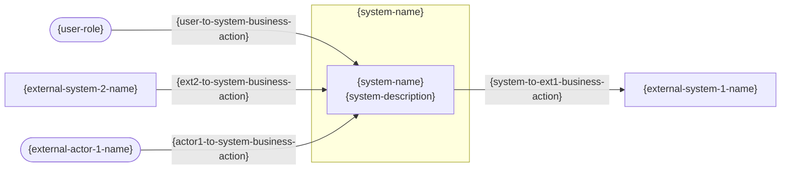
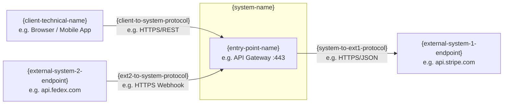
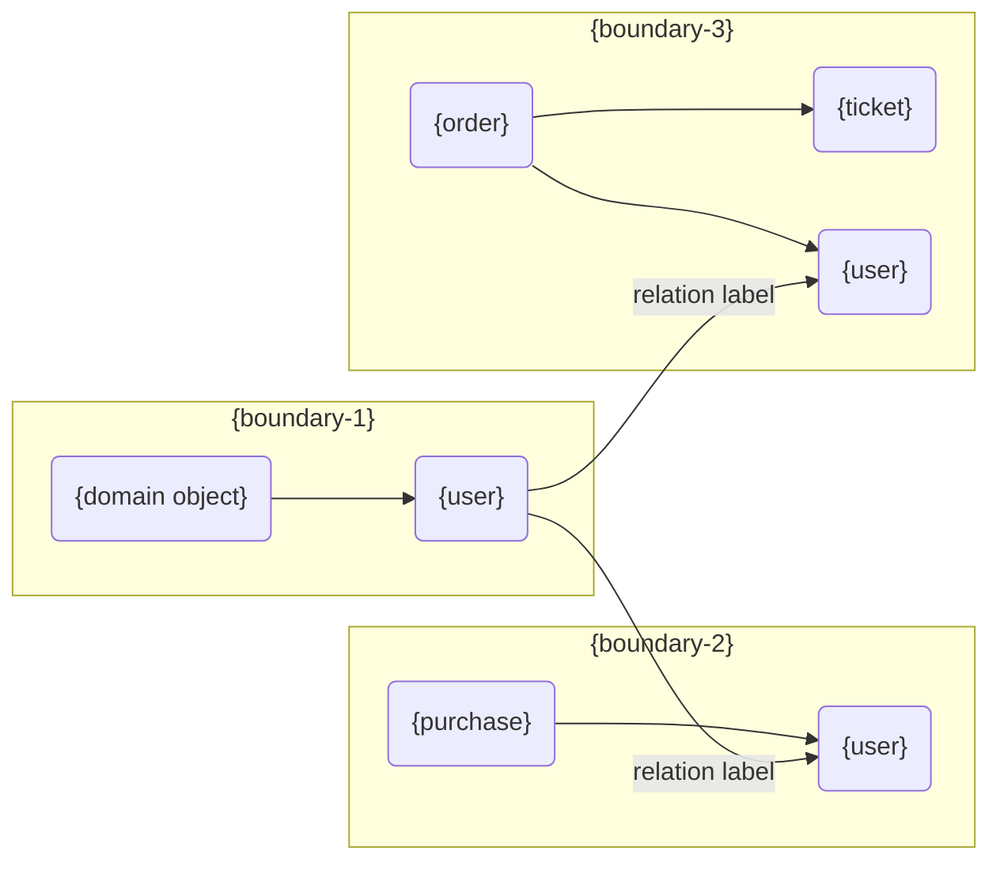
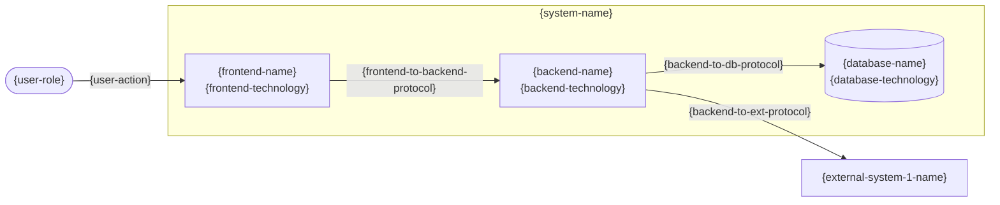
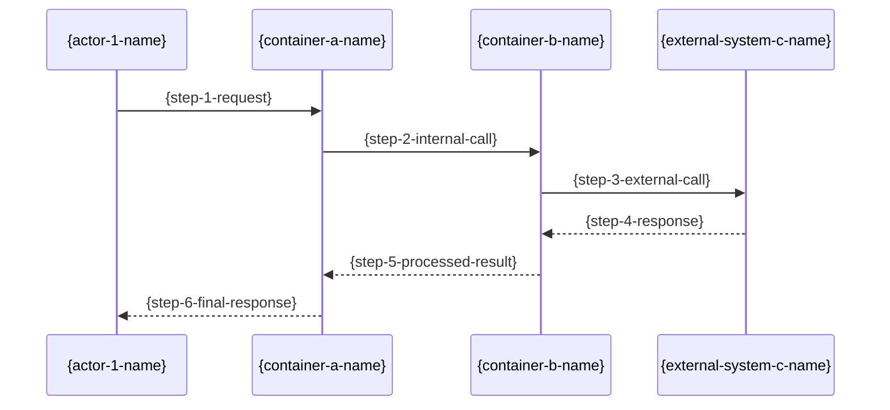
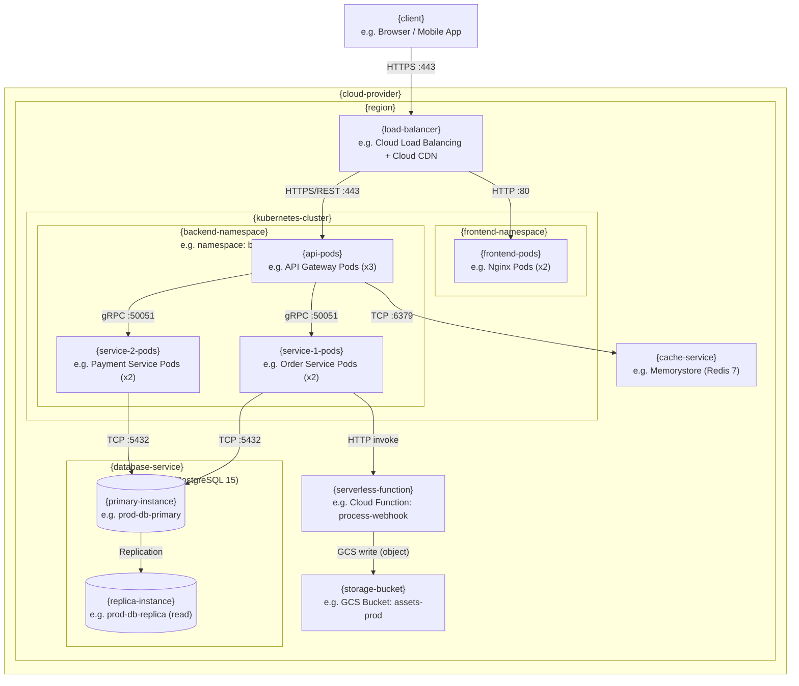

<!--
  TEMPLATE: Architecture Document
  ─────────────────────────────────────
  HOW TO USE THIS TEMPLATE:
  1. Replace every {placeholder} with the actual value for your project.
  2. Remove all HTML comment blocks (<!-- ... -->) before publishing or sharing.
  3. Expand scalable rows ({item-1}, {item-2}, ...) or remove optional sections as needed.

  PLACEHOLDER FORMAT:
  - All placeholders use the {kebab-case-name} syntax.
  - Multi-word names use hyphens: {system-name}, {quality-goal-1}.

  SECTIONS OVERVIEW:
     Introduction and Goals      — Business goals, quality goals, stakeholders
     Architecture Constraints    — Technical, organizational, and convention constraints
     Context and Scope           — System boundary, business and technical context
     Solution Strategy           — Key architectural decisions summary
     Building Block View         — Static decomposition: containers and components
     Runtime View                — Dynamic behavior: key scenario flows
     Deployment View             — Infrastructure and deployment mapping
     Cross-cutting Concepts      — Security, logging, error handling, and other shared concerns
     Architecture Decisions      — Index of significant decisions with links to external ADRs
     Quality Requirements        — Detailed quality attributes and measurable scenarios
     Risks and Technical Debts   — Prioritized risk register
-->
# Architecture Document

## Introduction and Goals

### Business Goals
- **goal 1** : description
- **goal 2** : description
- **goal 3** : description

### Requirements Overview

<!-- Purpose: list only the Architecture Significant Requirements (ASRs) — the functional
     requirements that have a direct impact on structural or technology decisions.
     Group multiple user stories or features into a single expression when they share the
     same architectural concern. Link to the full requirements document (PRD, backlog).
     Motivation: not all features drive architecture. Surfacing the ASRs here ensures the
     team understands which requirements justify the structural decisions made in sections 4–7.
     If a requirement does not constrain or justify any architectural decision, it does not belong here.
     Format: short bullet list. Keep it concise — avoid duplicating full specs. -->
- **feature 1** : description 
- **feature 2** : description
- **feature 3** : description

### Quality Goals

<!-- Purpose: list the top 3–5 quality attributes that most significantly shape the architecture.
     These are NOT project goals (timeline, budget) and NOT the complete quality catalog.
     They are the significant few that justify fundamental architectural decisions —
     e.g. "why we use a message broker", "why microservices", "why we have read replicas".
     Mention each with a brief scenario — enough to communicate the intent clearly.
     The complete catalog with measurable acceptance criteria lives in Section 10.
     Motivation: you must know the quality priorities of your key stakeholders because they
     drive the most consequential trade-offs. Without them, architectural decisions lack
     justification and the team cannot evaluate alternatives objectively.
     Format: table ordered by priority (highest architectural impact first),
     each row with a short measurable scenario. -->

| Priority | Quality Goal | Scenario |
|----------|-------------|----------|
| 1 | {quality-goal-1} | {quality-goal-1-scenario} |
| 2 | {quality-goal-2} | {quality-goal-2-scenario} |
| 3 | {quality-goal-3} | {quality-goal-3-scenario} |

### Stakeholders

<!-- Purpose: list all persons, roles, or organizations involved with or affected by the system.
     This determines the depth and scope of the documentation effort.
     Motivation: you may get nasty surprises if you start building without knowing all parties
     involved. Stakeholders define what the architecture must communicate and to whom,
     and they influence which quality attributes matter most.
     Format: table with role, contact, and what each stakeholder expects from the architecture docs. -->

| Role / Name | Contact | Expectations |
|-------------|---------|-------------|
| {stakeholder-1-role} | {stakeholder-1-contact} | {stakeholder-1-expectations} |
| {stakeholder-2-role} | {stakeholder-2-contact} | {stakeholder-2-expectations} |

---

## Architecture Constraints

<!-- Purpose: document all constraints that limit the architect's freedom of design.
     Constraints must always be acknowledged; some may be negotiable.
     Subdivide into: technical constraints, organizational/political constraints, and conventions.
     Motivation: an architect must know exactly where they are free to decide and where they
     must comply. Ignoring constraints leads to rework, conflict, or solutions that cannot
     be deployed, operated, or supported within the organization.
     Format: one table per constraint category. -->

## Technical Constraints

| ID | Constraint | Description |
|----|-----------|-------------|
| TC-1 | {tc-1-name} | {tc-1-description} |
| TC-2 | {tc-2-name} | {tc-2-description} |

## Organizational Constraints

| ID | Constraint | Description |
|----|-----------|-------------|
| OC-1 | {oc-1-name} | {oc-1-description} |
| OC-2 | {oc-2-name} | {oc-2-description} |

## Conventions

| ID | Convention | Description |
|----|-----------|-------------|
| CV-1 | {cv-1-name} | {cv-1-description} |

---

## Context and Scope

<!-- Purpose: define the system boundary — what is inside vs. outside — and all external
     communication partners (users, systems, and interfaces).
     Separate the business context (domain inputs/outputs) from the technical context
     (channels, protocols, hardware).
     Motivation: the external interfaces are among the most critical aspects of any system.
     Misunderstanding them leads to integration failures and costly rework. Every stakeholder
     must agree on what the system is responsible for and what lies outside its boundary. -->

### Business Context

<!-- PURPOSE: Show WHO interacts with the system and WHAT information is exchanged — in business language only.
     No protocols, no ports, no technology. Think: "what does the business care about?"
     Audience: all stakeholders, including non-technical (product owners, managers, clients).

     KEY RULE — use business language on the arrows:
       GOOD: "submits order", "requests payment authorization", "sends shipment notification"
       BAD:  "POST /orders", "HTTPS/REST", "JSON payload"

     DIAGRAM: use a mermaid flowchart (graph LR) with subgraph to visually group the system boundary.
     This makes the system boundary explicit and separates internal from external actors.

     EXAMPLE:
       [Customer] ──"places order"──► [Online Store] ──"authorizes payment"──► [Payment Gateway]
       [Warehouse System] ──"confirms stock"──►  [Online Store]

     MOTIVATION: all stakeholders — including non-technical ones — must understand which
     data and events are exchanged with the environment. This shared understanding prevents
     misaligned expectations between business, product, and engineering.

     HOW IT DIFFERS FROM 3.2:
       3.1 shows WHAT is exchanged (business events, domain data)
       3.2 shows HOW it is exchanged (protocols, endpoints, formats) -->

| Communication Partner | Inputs to System | Outputs from System |
|-----------------------|-----------------|-------------------|
| {partner-1-name} | {partner-1-inputs} | {partner-1-outputs} |
| {partner-2-name} | {partner-2-inputs} | {partner-2-outputs} |

### Technical Context

<!-- PURPOSE: Show HOW each business exchange from 3.1 happens technically — channels, protocols, and formats.
     This is the same picture as 3.1 but zoomed into the infrastructure layer.
     Audience: developers, infrastructure designers, integration teams.

     KEY RULE — use technical identifiers on the arrows:
       GOOD: "HTTPS/REST :443", "AMQP (RabbitMQ)", "SOAP/XML", "gRPC :50051"
       BAD:  "sends order", "payment request"

     DIAGRAM: use a mermaid flowchart (graph LR) with subgraph showing the system's technical entry point.
     Replace business actor names with their technical clients (Browser, Mobile App, Webhook, Cron Job).
     Replace external system names with their real endpoints or service identifiers.

     EXAMPLE:
       [Browser]  ──HTTPS/REST :443──►  [API Gateway]  ──HTTPS/JSON──►  [api.stripe.com]
       [api.stripe.com]  ──HTTPS Webhook──►  [API Gateway]

     MOTIVATION: infrastructure designers and integration teams make architectural decisions
     based on technical interfaces. Without this view, protocol mismatches and channel
     assumptions go undocumented and surface only during integration or incidents.

     HOW IT DIFFERS FROM 3.1:
       3.1 uses role names ("Customer", "Payment Gateway") and business actions ("places order")
       3.2 uses technical clients ("Browser", "api.stripe.com") and protocols ("HTTPS/REST :443") -->

| Channel | From → To | Protocol | Format |
|---------|-----------|----------|--------|
| {channel-1-name} | {channel-1-from} → {channel-1-to} | {channel-1-protocol} | {channel-1-format} |
| {channel-2-name} | {channel-2-from} → {channel-2-to} | {channel-2-protocol} | {channel-2-format} |

---

## Solution Strategy

<!-- Purpose: short summary of the fundamental decisions and solution strategies that shape the architecture.
     Cover: technology choices, top-level decomposition pattern, how quality goals are met,
     and any relevant organizational decisions. Include the architectural style and
     significant architectural patterns chosen.
     This is a quick-reference summary — details live in sections 5–9.
     Motivation: these decisions are the cornerstones of the architecture. They justify the
     structure documented in the sections that follow. New team members and stakeholders
     read this section first to understand the "why" before diving into the details.
     Format: decision table mapping quality goals or problems to decisions and rationale. -->

| Quality Goal / Problem | Decision | Rationale |
|-----------------------|----------|-----------|
| {solution-problem-1} | {solution-decision-1} | {solution-rationale-1} |
| {solution-problem-2} | {solution-decision-2} | {solution-rationale-2} |

---

## Building Block View

<!-- PURPOSE: Static decomposition of the system — the architectural "floor plan".
     This section is MANDATORY.
     MOTIVATION: maintaining an overview of the system's structure through abstraction
     allows communication with stakeholders without exposing implementation details.
     This is the most referenced section for onboarding new team members and for
     discussing structural changes without getting lost in code.

     FOLLOWS C4 MODEL LEVELS (Simon Brown):
       Context (L1)   → already covered in Section 3 (Context and Scope)
       Container (L2) → covered here: what's INSIDE the system
       Component (L3) → not included by default; add only if explicitly requested
       Code (L4)      → not documented at architecture level -->

### Event Storming

<!-- PURPOSE: Use a DDD Event Storming to identify domains, bounded contexts, and high-level building blocks.
     This is a recommended first step before drawing the container diagram. It helps discover the natural
     decomposition of the system based on domain events and business processes, rather than jumping
     straight into technical containers.

     MOTIVATION: starting with an Event Storming ensures that the architecture is aligned with the
     business domain and that we identify the right boundaries for our containers. It prevents
     premature technical decisions and promotes a domain-driven design approach.

     HOW TO DO IT:
       1. Gather domain experts, product owners, and architects for a collaborative session.
       2. Identify key domain events (e.g., "Order Placed", "Payment Authorized") and write them on sticky notes.
       3. Group related events into clusters that represent potential bounded contexts.
       4. Identify commands (actions) that trigger events and aggregate them around the relevant events.
       5. From these clusters, infer the high-level building blocks (containers) of the system.

     OUTPUT: a visual map of domain objects grouped by bounded contexts and their relationships and a table to see the domain events and how was grouped -->

| Domain Event | Domain Object | Bounded Context |
| ------------ | ------------- | --------------- |

### Container View

<!-- PURPOSE: Open the system and show its top-level containers and how they communicate.
     A container is any separately deployable/runnable unit: web app, API, database, queue, etc.
     Audience: developers, architects, technical stakeholders. (C4 Level 2)

     HOW THIS DIFFERS FROM Technical Context (3.2 — C4 L1):
       3.2 (C4 L1): system = black box. You only see the external boundary and entry points.
            [Browser] ──HTTPS──► [■ System ■] ──HTTPS──► [api.stripe.com]
       5.1 (C4 L2): system is OPEN. You see containers inside:
            [Browser] ──► ┌─ System ──────────────────────────┐ ──► [api.stripe.com]
                          │  [Frontend] ──► [API] ──► [DB]    │
                          └───────────────────────────────────┘

     DIAGRAM: use mermaid flowchart (graph LR) with subgraph for the system boundary.
     Show containers as nodes and label arrows with protocol + interaction.

     EXAMPLE:
       [User] ──uses──► ┌─ Online Store ──────────────────────────────┐
                        │  [React SPA] ──HTTPS/REST──► [Node.js API]  │
                        │                [Node.js API] ──SQL──► [DB]  │
                        └─────────────────────────────────────────────┘
                        [Node.js API] ──HTTPS/JSON──► [api.stripe.com]

     COMPONENT VIEW (C4 L3): Not included by default. Only add a component breakdown
     for a specific container if explicitly requested — it is rarely needed at
     architecture documentation level.

     MOTIVATION: {decomposition-motivation} -->

**Contained Building Blocks:**

| Name | Technology | Responsibility |
|------|-----------|----------------|
| {building-block-1-name} | {building-block-1-technology} | {building-block-1-responsibility} |
| {building-block-2-name} | {building-block-2-technology} | {building-block-2-responsibility} |
| {building-block-3-name} | {building-block-3-technology} | {building-block-3-responsibility} |

**Important Interfaces:**

<!-- Optional — describe interfaces not visible in the diagram above:
     syntax, protocols, error handling, version compatibility. -->

{important-interfaces-description}

---

## Runtime View

<!-- ══════════════════════════════════════════════════════════════════════════
     PURPOSE: Show how the system's building blocks BEHAVE at runtime.

     ⚠️  CRITICAL — WHAT GOES HERE (AND WHAT DOES NOT):

     ✅  PARTICIPANTS ARE ARCHITECTURAL COMPONENTS:
         Containers (web app, API, worker service), middleware (message broker,
         API gateway, cache), actors (user, admin) and external systems.
         These are the same building blocks from Sections 3 and 5.

     ❌  THIS IS NOT A CLASS DIAGRAM OR CODE-LEVEL SEQUENCE DIAGRAM.
         NEVER include: classes, methods, functions, objects, modules,
         or any internal implementation detail of a container.
         If a participant would only make sense to a developer reading the
         source code, it does not belong here.

     GOOD PARTICIPANTS:  User, Mobile App, API Gateway, Order Service,
                         Payment Service, RabbitMQ, Redis, Stripe API
     BAD PARTICIPANTS:   OrderController, PaymentRepository, UserSession,
                         validateToken(), OrderDTO

     ──────────────────────────────────────────────────────────────────────
     ⚠️  ASYNC OPERATIONS AND EVENTS — ONE TRIGGER PER DIAGRAM:

     Synchronous (request/response) and asynchronous (event/message) flows
     MUST be documented in SEPARATE diagrams.

     Each diagram must have ONE and only ONE trigger — the single initiating
     event or action that starts the flow.

     WHY: mixing sync and async in one diagram creates ambiguity about when
     things happen and who is waiting. A second trigger = a second diagram.

     ASYNC DIAGRAM PATTERN — use ->> without return arrows for fire-and-forget,
     and separate the consumption flow into its own diagram:

       Diagram A — Trigger: User places order (sync confirmation path)
         User ->> API Gateway ->> Order Service ->> "201 Created"

       Diagram B — Trigger: OrderPlaced event published (async processing path)
         Order Service ->> RabbitMQ: publish "OrderPlaced"
         RabbitMQ ->> Inventory Service: consume event
         RabbitMQ ->> Notification Service: consume event

     ──────────────────────────────────────────────────────────────────────
     FOCUS: architecturally relevant scenarios only — not every use case.
     Good candidates: critical paths, cross-container flows, error/recovery,
     async event chains.
     ══════════════════════════════════════════════════════════════════════════ -->

### Scenario 1: {scenario-1-name}

<!-- Trigger: {scenario-1-trigger}
     Flow type: {sync | async}
     Architectural relevance: {scenario-1-relevance}
     e.g. "Illustrates the token validation flow affecting all protected endpoints" -->

{scenario-1-notable-aspects}

### Scenario 2: {scenario-2-name}

<!-- Trigger: {scenario-2-trigger}
     Flow type: {sync | async}
     Add more scenarios as needed — one diagram per trigger. -->

{scenario-2-description}

---

## Deployment View

<!-- ══════════════════════════════════════════════════════════════════════════
     PURPOSE: Describe the INFRASTRUCTURE and show WHERE each software building
     block is deployed. This is NOT a software diagram — it is a topology diagram.

     ⚠️  KEY DISTINCTION — Deployment View vs. Container View (Section 5):

       Section 5 (C4 L2) — answers "WHAT software runs?":
         [Frontend App]  [API Service]  [Order Service]  [PostgreSQL]

       Section 7 (Deployment) — answers "WHERE does it run?":
         [GKE Cluster / us-central1]  [Cloud SQL instance / postgres-prod]
         [Cloud Storage bucket]  [Cloud Functions]  [Cloud Load Balancing]

     Nodes in this diagram are INFRASTRUCTURE RESOURCES, not software components.
     The software containers from Section 5 are mapped TO these resources in the
     table below the diagram.

     ──────────────────────────────────────────────────────────────────────
     INFRASTRUCTURE NODES TO USE (cloud-native examples):

     Compute:      GKE Cluster, GKE Node Pool, Cloud Run service,
                   Cloud Functions (serverless), Compute Engine VM
     Networking:   Cloud Load Balancing, Cloud CDN, API Gateway,
                   VPC, subnet, firewall rule
     Storage:      Cloud Storage bucket (GCS), Filestore
     Database:     Cloud SQL instance, Firestore, Bigtable, AlloyDB
     Messaging:    Pub/Sub topic/subscription, Cloud Tasks queue
     Security:     Cloud Armor, Secret Manager, IAM, VPC Service Controls
     Observability: Cloud Monitoring, Cloud Logging, Cloud Trace

     EXAMPLE — GCP production environment:
       ┌─ GCP Project: {project-id} / Region: us-central1 ──────────────────┐
       │  [Cloud Load Balancing]                                             │
       │  ┌─ GKE Cluster: {cluster-name} ─────────────────────────────────┐ │
       │  │  Namespace: frontend  → [Frontend Pod (Nginx)]                │ │
       │  │  Namespace: backend   → [API Pod] [Order Pod] [Payment Pod]   │ │
       │  └────────────────────────────────────────────────────────────────┘ │
       │  [Cloud Function: process-webhook]  (event-triggered, serverless)   │
       │  [GCS Bucket: {bucket-name}]        (static assets / file storage)  │
       │  ┌─ Cloud SQL (postgres-prod) ─────────────────────────────────────┐ │
       │  │  Primary instance  ──replication──►  Read Replica               │ │
       │  └──────────────────────────────────────────────────────────────────┘ │
       └─────────────────────────────────────────────────────────────────────┘
     ══════════════════════════════════════════════════════════════════════════ -->

### Infrastructure Level 1

<!-- Motivation: {deployment-motivation} -->

**Mapping of Building Blocks to Infrastructure:**

| Software (Section 5) | Infrastructure Resource | Type | Notes |
|----------------------|------------------------|------|-------|
| {building-block-1-name} | {infra-resource-1} | {e.g. GKE Pod} | {infra-notes-1} |
| {building-block-2-name} | {infra-resource-2} | {e.g. Cloud SQL} | {infra-notes-2} |
| {building-block-3-name} | {infra-resource-3} | {e.g. Cloud Function} | {infra-notes-3} |
| {building-block-4-name} | {infra-resource-4} | {e.g. GCS Bucket} | {infra-notes-4} |

---

## Cross-cutting Concepts

<!-- Purpose: document architectural concepts that span multiple building blocks.
     Pick ONLY the most relevant topics for the system — do not attempt to cover everything.
     Motivation: concepts form the basis for conceptual integrity (consistency, homogeneity)
     of the architecture. Documenting them centrally avoids repetition across building block
     descriptions and ensures all teams follow the same patterns for cross-cutting concerns
     such as authentication, error handling, and observability.
     Format: one subsection per concept, with description and any architectural-level conventions.
     Typical topics: Authentication and Authorization, Error Handling and Logging,
     Configuration Management, Data Validation, Caching Strategy, API Versioning. -->

### {concept-1-name}

{concept-1-description}

### {concept-2-name}

{concept-2-description}

### {concept-3-name}

{concept-3-description}

---

## Architecture Decisions

<!-- Purpose: Index of significant architectural decisions with links to external ADRs.
     Each row links to a fully-documented Architecture Decision Record (ADR) stored as
     an external file in the decision records folder. This section provides quick reference
     and traceability, while details live in the external ADR documents.
     
     CRITICAL: ADRs are stored as EXTERNAL documents — NOT embedded inline here.
     This section creates the bridge between the quick-reference Solution Strategy (Section 4)
     and the deep-dive decision documentation.
     
     Motivation: Architectural decisions carry rationale, trade-offs, and consequences that
     need full context. Storing them externally keeps the architecture document concise
     while ensuring decisions are properly documented and discoverable.
     
     Format: table with decision ID, title, status, date, and link to external ADR file. -->

| ID | Decision | Status | Date | ADR File | Rationale |
|---|---|---|---|---|---|
| AD-01 | {decision-1-title} | {decision-1-status} | {decision-1-date} | [Link]({adr-1-filename}) | {decision-1-rationale} |
| AD-02 | {decision-2-title} | {decision-2-status} | {decision-2-date} | [Link]({adr-2-filename}) | {decision-2-rationale} |

---

## Quality Requirements

<!-- Purpose: complete catalog of all quality requirements with measurable acceptance criteria.
     The top 3–5 quality goals that drive the architecture are declared in Section 1 —
     reference them here rather than redefining them.
     This section adds the full list: all remaining quality requirements of lower priority
     (desirable but not critical — these will not create high risks if not fully achieved).
     Motivation: quality requirements heavily influence architectural decisions. Making them
     specific and measurable here turns them into verifiable acceptance criteria for
     testing, reviews, and audits — not just aspirational statements. -->

### Quality Requirements Overview

<!-- Purpose: summarize all quality requirements grouped by ISO 25010:2023 category.
     Motivation: a single overview table provides a quick map of quality coverage across
     all dimensions. It ensures no important category (e.g. portability, maintainability)
     was overlooked during architecture design.
     Format: one row per category with a concrete, measurable description.
     Avoid vague statements — "secure" is not measurable; "all API endpoints require
     JWT authentication validated against the IdP on every request" is. -->

| Category (ISO 25010) | Quality Attribute | Description |
|---------------------|------------------|-------------|
| Functional Suitability | {qa-functional-attribute} | {qa-functional-description} |
| Performance Efficiency | {qa-performance-attribute} | {qa-performance-description} |
| Compatibility | {qa-compatibility-attribute} | {qa-compatibility-description} |
| Usability | {qa-usability-attribute} | {qa-usability-description} |
| Reliability | {qa-reliability-attribute} | {qa-reliability-description} |
| Security | {qa-security-attribute} | {qa-security-description} |
| Maintainability | {qa-maintainability-attribute} | {qa-maintainability-description} |
| Portability | {qa-portability-attribute} | {qa-portability-description} |

### Quality Scenarios

<!-- Purpose: define quality requirements as specific, measurable scenarios that serve as
     verifiable acceptance criteria.
     Motivation: a quality requirement without a measurable scenario is just an aspiration.
     Scenarios bridge the gap between intent and verification — they tell QA, architects,
     and auditors exactly how to confirm a quality goal is met.
     Two types:
     - Usage scenarios: runtime reaction to a stimulus (e.g. "system responds in < 200 ms under load").
     - Change scenarios: effect of modifying the system (e.g. "adding a new payment method takes < 2 days").
     Format: a scenario is complete ONLY when the Measure column contains a concrete metric. -->

| ID | Scenario Name | Source | Stimulus | Environment | Artifact | Response | Measure |
|----|--------------|--------|----------|-------------|----------|----------|---------|
| QS-01 | {qs-1-name} | {qs-1-source} | {qs-1-stimulus} | {qs-1-environment} | {qs-1-artifact} | {qs-1-response} | {qs-1-measure} |
| QS-02 | {qs-2-name} | {qs-2-source} | {qs-2-stimulus} | {qs-2-environment} | {qs-2-artifact} | {qs-2-response} | {qs-2-measure} |

---

## Risks and Technical Debts

<!-- Purpose: prioritized register of identified technical risks and accumulated technical debts.
     Keep this section updated — it is a direct input to project management and governance.
     Motivation: "Risk management is project management for grown-ups." (Tim Lister)
     Architecture decisions always carry risk. Making risks explicit allows the team and
     management to allocate remediation time before risks become incidents or project blockers.
     Technical debts left undocumented silently accumulate until they become crises.
     Format: table ordered by priority (High → Medium → Low).
     Each row must have a concrete mitigation strategy — "monitor" is not a strategy. -->

| Priority | Risk / Technical Debt | Probability | Impact | Mitigation Strategy |
|----------|-----------------------|-------------|--------|-------------------|
| High | {risk-1-description} | {risk-1-probability} | {risk-1-impact} | {risk-1-mitigation} |
| Medium | {risk-2-description} | {risk-2-probability} | {risk-2-impact} | {risk-2-mitigation} |
| Low | {risk-3-description} | {risk-3-probability} | {risk-3-impact} | {risk-3-mitigation} |

---

## Gap Analysis _(optional — brownfield projects only)_

<!-- PURPOSE: Identify and communicate the architectural delta between the current as-is state and the target to-be state.
     Include this section only when there is a defined current state (from brownfield archaeology) and a target state to compare against.

     MOTIVATION: Without an explicit gap analysis, teams lack a shared understanding of what must change, in what order,
     and what the risks of each change are. This section turns the comparison into an actionable, prioritized list.

     HOW TO FILL:
     - Organize by architectural area (Structure, Data, Integrations, Security, Cross-cutting, Deployment, Quality).
     - Skip areas where no gap exists — state "no gap identified" to confirm it was checked.
     - Ground every gap in facts from the archaeology snapshot and the target architecture. No assumptions.
     - Use the sequencing table to indicate dependencies and recommended delivery order.
     - Impact: High / Medium / Low — architectural significance, not implementation effort.

     FORMAT: one gap table per area + one sequencing recommendation table at the end. -->

### {gap-area-1-name}

<!-- e.g. Structure, Data, Integrations, Security, Cross-cutting Concepts, Deployment, Quality Attributes -->

| ID | Current (As-Is) | Target (To-Be) | Gap | Impact | Depends On |
|----|----------------|----------------|-----|--------|------------|
| G-01 | {current-state-description} | {target-state-description} | {specific-delta} | High / Medium / Low | — |
| G-02 | {current-state-description} | {target-state-description} | {specific-delta} | High / Medium / Low | G-01 |

### {gap-area-2-name}

| ID | Current (As-Is) | Target (To-Be) | Gap | Impact | Depends On |
|----|----------------|----------------|-----|--------|------------|
| G-03 | {current-state-description} | {target-state-description} | {specific-delta} | High / Medium / Low | — |

### Sequencing Recommendation

<!-- Group gaps into delivery waves based on dependencies and impact.
     Wave 1 = foundational (others depend on these). Wave 2 = high impact. Wave 3 = incremental. -->

| Wave | Gaps | Rationale |
|------|------|-----------|
| Wave 1 — Foundational | G-01, G-03 | {rationale for doing these first} |
| Wave 2 — High Impact  | G-02 | {rationale} |
| Wave 3 — Incremental  | {gap-ids} | {rationale} |

---

## Panel Review Summary

<!-- PURPOSE: Provide a concise, section-by-section record of what the Architecture Panel Review (Step 12) found
     and changed. This section belongs in the architecture document as a permanent audit trail of the review.
     It summarizes the OUTCOME — not the raw panelist comments (those live in the companion panel-review-log.md file).

     MOTIVATION: readers who inherit or revisit this document need to know which parts were scrutinized,
     what was challenged, and what was deliberately improved vs. left unchanged. Without this section,
     the document looks like it was written perfectly on the first pass — which obscures risk and erodes trust.

     WHEN TO FILL: after Step 12 (Architecture Panel Review) completes. Leave the placeholder rows
     until the panel review has been executed.

     HOW TO FILL:
     - One row per reviewed section (## heading).
     - "Key Improvements": the most significant additions or rewrites made in Phase B — be specific,
       reference actual content (e.g. "added CDN as explicit building block", not "improved section").
     - "Consensus Issues Resolved": concerns raised by 2+ panelists that were incorporated — these are
       the highest-confidence changes.
     - "Specialist Issues Added": concerns raised by a single panelist that were accepted — note which
       specialist (e.g. "DevOps: added cold start note").
     - "Impact": High / Medium / Low / Critical — reflects how materially the section changed and the
       downstream risk that would have existed without the correction. -->

| Section | Key Improvements | Consensus Issues Resolved | Specialist Issues Added | Impact |
|---------|-----------------|--------------------------|------------------------|--------|
| {section-1-name} | {section-1-key-improvements} | {section-1-consensus-issues} | {section-1-specialist-issues} | {section-1-impact} |
| {section-2-name} | {section-2-key-improvements} | {section-2-consensus-issues} | {section-2-specialist-issues} | {section-2-impact} |

---

### Executive Summary

<!-- PURPOSE: A short narrative (3–6 sentences) that answers: "What did the panel find, and does this
     document reflect those findings?"

     MOTIVATION: the table above is scannable but not readable. This paragraph gives context to a
     reader who wants to understand the overall health of the document after review — including
     whether any critical issues were found, and whether they were resolved or deferred.

     HOW TO FILL:
     - State the number of Critical / High / Medium issues found.
     - Call out the most impactful corrections with their sections (e.g. "Two critical issues were found:
       iOS sync trigger was incorrect across Sections 4, 5, 6 and 10; staging environment was absent from
       Section 7 despite being required by OC-07.").
     - End with a readiness statement: is the document fit to guide implementation?
     - Keep it factual — this is not a marketing paragraph. -->

{panel-review-executive-summary}