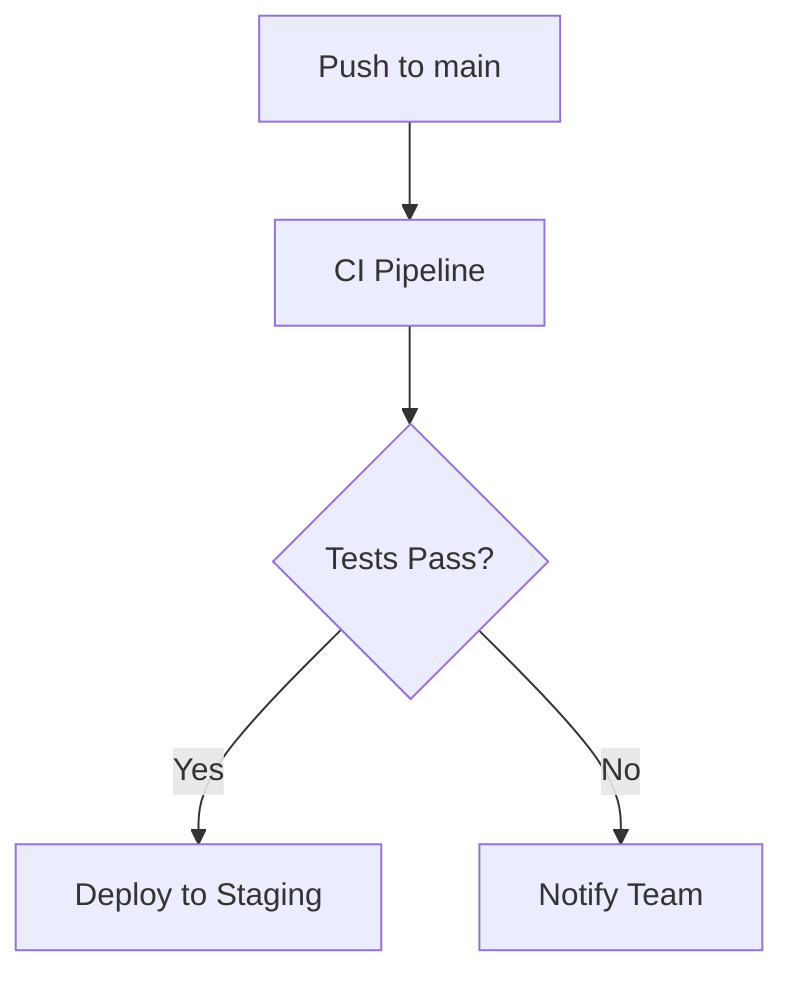

# What is a Platform Technical Specification

A platform technical specification defines how to implement a **technical task** that does not originate from a user story or functional requirement. These are tasks that enable the system and team to operate: infrastructure provisioning, pipelines, network configuration, environment setup, monitoring, security hardening, and repository management.

It answers: *What needs to be configured or built? What are the exact parameters and dependencies? How do we verify it works and undo it if it fails?*

The spec is always scoped to a single task. It does not redesign the system — it identifies the minimal set of changes needed to achieve the stated goal within the existing platform constraints.

## Document Lifecycle

| Status | Meaning |
|---|---|
| `draft` | Initially produced from the task description. Contains key decisions and open questions. Ready for peer review. |
| `approved` | Validated after technical review. All open questions resolved. Ready for implementation. |

## What it IS and IS NOT

It **IS**:
- A design document — it captures the plan, structure, and intent, not a full implementation
- Clear enough that an engineer can execute the task without ambiguity
- Self-contained — includes rollback and verification so it is safe to execute in production
- Free to include YAML snippets, environment variables, configuration examples, or IaC excerpts **when they clarify the design intent** — these are welcome as design artifacts, not prohibited

It is **NOT**:
- An architecture document — it operates within the existing architecture, it does not redefine it
- A user story specification — if the task maps to a user-facing feature, use `dev.create-tech-spec` instead

# Input

The skill expects a **technical task description** as input. Collect the following before generating the specification. If the user has not provided all required fields, ask clarifying questions first.

```yaml
technical-task:
  goal: "Short description of what needs to be achieved"          # required
  context: "Current state, environment, existing systems involved" # required
  affected-environments: []  # e.g., [dev, staging, prod] or [all]  # required
  constraints: []            # Cost, time, tool, or access limits   # optional
  out-of-scope: []           # What is explicitly NOT part of this task # optional
```

# Critical Patterns

## Scope — What goes in a platform spec

Include this spec type for:
- Infrastructure provisioning (VPCs, subnets, databases, storage, DNS, TLS)
- CI/CD pipeline setup or modification
- Repository and branching strategy configuration
- Environment creation and promotion strategy
- Monitoring, alerting, and observability setup
- IAM roles, policies, and access control
- Secret management and key rotation
- Cloud networking configuration

**Not for** user-facing features. If the task maps to a user story, use `dev.create-tech-spec` instead.

## Component Actions

Every resource or component listed must declare its action:

| Action | Meaning |
|---|---|
| `CREATE` | New resource that does not exist yet |
| `MODIFY` | Existing resource that requires changes |
| `DELETE` | Resource to be removed |
| `CONFIGURE` | Existing resource that needs configuration but not structural changes |

Never list a resource without its action.

## Configuration Contract Notation

Use YAML to document all configuration parameters, environment variables, and secrets.
Every field must include: data type, required/optional, and constraints or allowed values.

```yaml
# Pipeline — GitHub Actions
repository: str        # str, required, format: org/repo
branch_main: str       # str, required, default: main
environments:
  - name: str          # str, required, enum: [dev, staging, prod]
    auto_deploy: bool  # bool, required
    requires_approval: bool  # bool, required
secrets:
  DB_PASSWORD: str     # str, required, managed in GitHub Secrets
  API_KEY: str         # str, required, managed in GitHub Secrets
```

## Diagram

Include a Mermaid diagram when the task involves topology, network flows, pipeline stages, or multi-system connections. Skip this section when the task is purely parameter configuration with no structural relationships.



## Steps

Steps must be:
- **Ordered** — each step follows logically from the previous one
- **Independently executable** — a single engineer can perform each step in isolation
- **Verifiable** — each step should state how to confirm it completed successfully before moving to the next

Avoid grouping unrelated actions into a single step. If a step requires a decision, document the decision criteria.

## Acceptance Criteria

Every spec must include verifiable acceptance criteria. These must be testable commands, observable states, or measurable outcomes — not aspirational statements.

| Good | Bad |
|---|---|
| `Pipeline triggers within 30s of push to main` | `Pipeline works correctly` |
| `curl https://api.staging.example.com returns HTTP 200` | `API is reachable` |
| `terraform plan shows 0 changes after apply` | `Infrastructure is configured` |


# Document

- **Template**: See [assets/template.md](assets/template.md) for the output document template
- Each section is optional, include only what is relevant to the task
- Use clear, concise language — this is a design document, not an essay
