# Journey Overview — All User Journeys

## Journeys Summary

| Journey | Actors | Sub-journeys | Steps (total) |
|---|---|---|---|
| [Wedding Management](./20260810-wedding-management-journey.md) | Wedding Planner, Administrator | Register wedding · Edit wedding · List weddings · Archive wedding · Admin overview | 18 |
| [User & Role Management](./20260810-user-and-role-management-journey.md) | Administrator, Wedding Planner | Onboard WP · Disable WP · Reset password · WP login · Manage profile | 19 |
| [Photo Storage](./20260810-photo-storage-journey.md) | Wedding Planner, Couple, Administrator | Configure storage · Upload photos · Download archive · Share upload link · Couple receives USB · Couple uploads | 22 |
| [Online Invitation](./20260810-online-invitation-journey.md) | Wedding Planner, Guest, Administrator | Publish invitation · Update after publish · Guest views invitation · Guest RSVP · Guest uploads photos | 19 |
| [Guest List Management](./20260810-guest-list-management-journey.md) | Wedding Planner, Administrator | Add guest · Edit guest · Delete guest · Mark attendance · Generate links · Import/export CSV | 25 |

## Mockup Coverage — Journey vs Screen

> Reviewed: 2026-08-12 · Mockup path: `2-product/2.1-discovery/2.1.6-design/mockup/`

### User & Role Management

| Sub-journey | Actor | Mockup Screen | Status |
|---|---|---|---|
| WP Login | Wedding Planner | [01-login.html](../../2.1.6-design/mockup/01-login.html) | ✅ |
| Onboard WP | Admin | [17-admin-wp-form.html](../../2.1.6-design/mockup/17-admin-wp-form.html) | ✅ |
| Disable WP | Admin | [16-admin-wp-list.html](../../2.1.6-design/mockup/16-admin-wp-list.html) — botón Deactivate ⊘ en tabla | ✅ |
| Reset Password | Admin | [17-admin-wp-form.html](../../2.1.6-design/mockup/17-admin-wp-form.html) — botón Generate en campo Password | ⚠️ Implícito |
| Manage Profile | Wedding Planner | [14-my-profile.html](../../2.1.6-design/mockup/14-my-profile.html) | ✅ |

### Wedding Management

| Sub-journey | Actor | Mockup Screen | Status |
|---|---|---|---|
| Register Wedding | Wedding Planner | [06-wedding-form.html](../../2.1.6-design/mockup/06-wedding-form.html) | ✅ |
| Edit Wedding | Wedding Planner | [06-wedding-form.html](../../2.1.6-design/mockup/06-wedding-form.html) — mismo form pre-filled | ✅ |
| List Weddings | Wedding Planner | [02-dashboard.html](../../2.1.6-design/mockup/02-dashboard.html) — cards con search/filter | ✅ |
| Archive Wedding | Wedding Planner | [05-wedding-detail.html](../../2.1.6-design/mockup/05-wedding-detail.html) — botón Archive · [02-dashboard.html](../../2.1.6-design/mockup/02-dashboard.html) — filtro Archived | ✅ |
| Admin Overview | Admin | [02-dashboard.html](../../2.1.6-design/mockup/02-dashboard.html) — misma pantalla, Admin ve bodas de todos los WPs | ✅ |

### Guest List Management

| Sub-journey | Actor | Mockup Screen | Status |
|---|---|---|---|
| Add Guest | Wedding Planner | [07-add-guest.html](../../2.1.6-design/mockup/07-add-guest.html) | ✅ |
| Add Guest Group | Wedding Planner | [08-add-guest-group.html](../../2.1.6-design/mockup/08-add-guest-group.html) | ✅ |
| Edit Guest | Wedding Planner | [09-edit-guest.html](../../2.1.6-design/mockup/09-edit-guest.html) | ✅ |
| Delete Guest | Wedding Planner | [09-edit-guest.html](../../2.1.6-design/mockup/09-edit-guest.html) — botón Delete con confirmación | ✅ |
| Mark Attendance | Wedding Planner | [05-wedding-detail.html#guests](../../2.1.6-design/mockup/05-wedding-detail.html) — inline RSVP editing | ✅ |
| Generate Links | Wedding Planner | [09-edit-guest.html](../../2.1.6-design/mockup/09-edit-guest.html) — invitation link panel | ✅ |
| Import / Export CSV | Wedding Planner | [11-import-export.html](../../2.1.6-design/mockup/11-import-export.html) | ✅ |

### Online Invitation

| Sub-journey | Actor | Mockup Screen | Status |
|---|---|---|---|
| Publish Invitation | Wedding Planner | [12-invitation-manage.html](../../2.1.6-design/mockup/12-invitation-manage.html) — tabs Preview + Publish | ✅ |
| Update After Publish | Wedding Planner | [06-wedding-form.html](../../2.1.6-design/mockup/06-wedding-form.html) → [12-invitation-manage.html](../../2.1.6-design/mockup/12-invitation-manage.html) | ✅ |
| Guest Views Invitation | Guest | [04-invitation.html](../../2.1.6-design/mockup/04-invitation.html) — story, ubicación, programa, galería | ✅ |
| Guest RSVP | Guest | [04-invitation.html](../../2.1.6-design/mockup/04-invitation.html) — sección RSVP | ✅ |
| Guest Uploads Photos | Guest | [04-invitation.html](../../2.1.6-design/mockup/04-invitation.html) — álbum con drag-drop | ✅ |
| Moderate Guest Photos | Wedding Planner | [12-invitation-manage.html](../../2.1.6-design/mockup/12-invitation-manage.html) — tab Moderate | ✅ |

### Photo Storage

| Sub-journey | Actor | Mockup Screen | Status |
|---|---|---|---|
| Configure Storage | Wedding Planner | [05-wedding-detail.html#photos](../../2.1.6-design/mockup/05-wedding-detail.html) — toggle enable + quality | ✅ |
| Upload Official Photos | Wedding Planner | [05-wedding-detail.html#photos](../../2.1.6-design/mockup/05-wedding-detail.html) — drag-drop, cap 200 | ✅ |
| Download Archive | Wedding Planner | [05-wedding-detail.html#photos](../../2.1.6-design/mockup/05-wedding-detail.html) — botón Download All | ✅ |
| Share Couple Upload Link | Wedding Planner | [05-wedding-detail.html#photos](../../2.1.6-design/mockup/05-wedding-detail.html) — copy couple link | ✅ |
| Couple Receives USB | Couple | Paso físico — no requiere pantalla | ✅ N/A |
| Couple Uploads Photos | Couple | [15-couple-upload.html](../../2.1.6-design/mockup/15-couple-upload.html) — token-gated, sin login | ✅ |
| Admin Storage Monitoring | Admin | [05-wedding-detail.html#photos](../../2.1.6-design/mockup/05-wedding-detail.html) — Admin accede al detalle de cualquier boda | ✅ |

### Features en mockup sin sub-journey explícito

| Feature | Pantalla | Nota |
|---|---|---|
| Toggle idioma ES / EN | [01-login.html](../../2.1.6-design/mockup/01-login.html) · [14-my-profile.html](../../2.1.6-design/mockup/14-my-profile.html) | Cubierto por ADR-08 (i18next); sin journey formal |
| Setup Checklist por boda | [05-wedding-detail.html#overview](../../2.1.6-design/mockup/05-wedding-detail.html) | Derivado de oportunidad del Wedding Management journey |

---

# Resumen visual
Journey                     Cobertura mockup
──────────────────────────────────────────────────────────────────
User & Role Management      ████████████████████░  4/5 ✅  1 parcial ⚠️
Wedding Management          █████████████████████  5/5 ✅  
Guest List Management       █████████████████████  7/7 ✅
Online Invitation           █████████████████████  6/6 ✅ 
Photo Storage               █████████████████████  6/6 ✅ 

Admin cross-cutting view    █████████████████████  1/1 ✅  

---

## Timeline — Steps per Journey

```mermaid
timeline
    title Wendy Planner — User Journey Steps
    section User & Role Management
        Onboard WP : Open platform : Create WP account : Assign password : Hand credentials : Verify active
        Disable WP : Search WP : Disable account : Confirm lockout
        Reset Password : Locate account : Generate password : Confirm login
        WP Login : Open app : Enter username : Enter password : Access dashboard
        Manage Profile : Open profile : Update info : Save changes
    section Wedding Management
        Register Wedding : Login : Open weddings list : New wedding : Enter couple names : Set date : Save
        Edit Wedding : Open wedding : Update details : Save changes
        List Weddings : Open dashboard : Search / filter : View details
        Archive Wedding : Identify past weddings : Archive : Confirm hidden
        Admin Overview : Login as Admin : Open weddings overview : Inspect wedding
    section Guest List Management
        Add Guest : Open wedding : Open Guests tab : Add guest : Choose group : Enter details : Save
        Edit Guest : Locate guest : Open detail : Update info : Save
        Delete Guest : Locate guest : Delete : Confirm deletion
        Mark Attendance : Locate guest : Set status : Save
        Generate Links : Copy link : Deliver link : Track delivery
        Import / Export CSV : Export guest list : Import updated list
    section Online Invitation
        Publish Invitation : Open wedding : Open Invitation tab : Choose template : Verify data : Publish : Verify link
        Update After Publish : Edit wedding data : Confirm live invitation updated
        Guest Views Invitation : Receive link : Open link : Browse details : View gallery
        Guest RSVP : Locate RSVP section : Confirm attendance : See confirmation
        Guest Uploads Photos : Open album : Drag-and-drop photos : Reach cap
    section Photo Storage
        Configure Storage : Open wedding : Open Photos tab : Enable storage : Choose quality : Save
        Upload Official Photos : Open Photos tab : Select files : Watch 200-photo cap : Handle rejected uploads
        Download Archive : Open Photos tab : Download all : Receive archive : Prepare USB
        Share Upload Link : Copy couple link : Send link out-of-band
        Couple Receives USB : Receive USB from WP : View photos on device
        Couple Uploads Photos : Open shared link : Drag-and-drop photos : Reach 20-photo cap
```

