# Wendy Planner — Architecture Document

> **Status:** Target architecture (greenfield, MVP).
> **Audience:** Delivery team (1 BE + 1 FE), Tech Lead, Product Owner, Vineyards stakeholders.
> **Style:** Pragmatic. Optimized for a 2-person team delivering an MVP in 3 months while leaving the door open for future iterations (multi-tenancy, budget/vendor modules, more languages).

---

## 1. Introduction and Goals

Wendy Planner is a web application for Vineyards' Wedding Planners (WPs) to manage a wedding end-to-end inside a single shared tool, replacing the current Excel-based manual workflow. The MVP targets **2 real weddings captured end-to-end** as the success metric.

### 1.1 Business Goals

| # | Business Goal | Source |
|---|---------------|--------|
| BG-1 | **Standardize the core WP workflow** for in-scope capabilities (wedding data, guest list, invitation, photos) so all 10 WPs at Vineyards follow the same process. | Project Brief §Objectives |
| BG-2 | **Eliminate Excel** for the in-scope flows within the MVP, removing version-control and handoff issues. | Project Brief §Objectives |
| BG-3 | **Validate scalability assumption** by capturing 2 real weddings end-to-end (WP onboarding → wedding creation → published invitation → RSVPs → photo download). | Project Brief §Objectives |
| BG-4 | **Ship a foundation that supports future iterations** — budget/vendor management, multi-tenancy enforcement, additional languages — without rewriting the MVP. | Project Brief §Objectives |

### 1.2 Requirements Overview (Architecture-Significant Requirements)

The following functional requirements are the ones that **shape structural or technology decisions**. The complete product backlog lives in `2-product/2.2-planning/`.

| ID | ASR | Architectural impact |
|----|-----|----------------------|
| ASR-1 | **Wedding data capture** — name of couple, wedding date, and the 14 invitation modules (landing, story, location, schedule, dress code, gifts, RSVP, gallery, contact, etc.) must be stored per wedding and rendered into a public invitation. | Drives the **Wedding** bounded context and the need for flexible per-template data (JSON). |
| ASR-2 | **Guest list + RSVP** — CRUD for guest groups and guests; each guest has a unique invitation link; RSVP is submitted through that link with three states (Confirmed / Declined / Pending). | Drives **Guest Management** bounded context, token-based public link generation, and the decision to lazy-load the public invitation route in the SPA. |
| ASR-3 | **Public online invitation** with 6 fixed generic templates selected by the WP. The platform fills the template with the wedding's data. No per-wedding layout customization in MVP. | Drives the choice of **server-side rendering** for invitation pages (SEO + first paint) and the **Template** module inside the Invitation bounded context. |
| ASR-4 | **Photo storage** — official photos per wedding (max 200), configurable quality (High/Low), shared upload link for the couple, auto-delete **1 month after the event date**. | Drives the **Photo Storage** bounded context, the use of **object storage with lifecycle policies**, and a scheduled job to enforce deletion. |
| ASR-5 | **Authentication & roles** — Administrator and Wedding Planner roles, credentials `nombre@wendy`, passwords assigned by the Administrator. No self-service password recovery in MVP. | Drives the **Identity & Access** bounded context, JWT-based stateless auth, and a dedicated seed for the initial `admin@wendy`. |
| ASR-6 | **Bilingual UI (EN default, ES)** auto-detected from `Accept-Language`, with architecture ready for additional languages. | Drives the **i18n strategy** (no hard-coded strings, locale-aware routing on invitations, message catalogs at the framework level). |
| ASR-7 | **Multi-tenancy preparation** — `tenant_id` column on all relevant tables from day one. Row-level isolation **not enforced** in MVP. | Drives the **schema design** (every domain entity carries `tenant_id`) but defers policy/RLS to a later iteration. |

### 1.3 Quality Goals

The top 3–5 quality attributes that most significantly shape this architecture. The full measurable catalog lives in §10.

| Priority | Quality Goal | Scenario (intent) |
|----------|--------------|-------------------|
| 1 | **Time-to-MVP** | A 2-person team ships a working MVP within **3 months** (6 sprints × 2 weeks) covering 2 end-to-end pilot weddings. |
| 2 | **Cost consciousness** | Recurring infrastructure cost stays below a small fixed monthly budget (≤ low hundreds USD/month) while serving 10 WPs and up to ~100 weddings/year. Storage lifecycle prevents unbounded growth. |
| 3 | **Operational simplicity** | The 2-person team can deploy, observe, and recover the system without dedicated DevOps. Container-based, managed services only. |
| 4 | **Evolvability** | Adding a new bounded context (e.g. budget, vendors), a new language, or enforcing multi-tenancy later requires **additive** changes — not rewrites. |
| 5 | **Invitation availability & performance** | A guest's invitation link loads in **< 2 s first paint** on PC/tablet, with 99.5% availability during the 24 h before/after a wedding. |

### 1.4 Stakeholders

| Role / Name | Contact | Expectations |
|-------------|---------|--------------|
| Product Owner (Vineyards) | TBD — pending precondition | Clear, prioritized backlog; access to UAT environment; timely answers to questions. |
| Wedding Planners (Vineyards, ~10 users) | Through the Administrator | Standardized workflow, no Excel for in-scope flows, bilingual UI, ability to share invitation links and photos. |
| Administrator (initial: `admin@wendy`, seeded) | — | Ability to onboard/disable WPs, reset passwords, supervise all owned weddings. |
| Invited Guests (external, public link) | Per-wedding invitation link | Fast-loading, mobile-readable invitation; simple RSVP; optional photo upload. |
| Couples (external, shared link only) | Per-wedding link from WP | Upload official photos via shared link; download photos post-event. |
| Delivery Team — Backend Developer | TBD | Clear API contract, simple local setup, documented ADRs, deterministic builds. |
| Delivery Team — Frontend Developer | TBD | Shared types, design system, single command to run the app locally. |
| Tech Lead / Architect (this document) | — | Architecture is small enough to be understood end-to-end by a single person. |

---

## 2. Architecture Constraints

Constraints that limit the architect's freedom of design. Some are negotiable; the kickoff and project brief are the source of truth.

### 2.1 Technical Constraints

| ID | Constraint | Description | Source |
|----|-----------|-------------|--------|
| TC-1 | **Modular monolith** | The system is a single deployable unit organized into modules by bounded context. Microservices are explicitly out of scope. | Kickoff §Restricciones técnicas |
| TC-2 | **Container-based deployment** | The system is packaged as containers and deployed to a cloud provider. | Kickoff §Restricciones técnicas |
| TC-3 | **Cloud-hosted only** | No on-premise hosting. | Kickoff §Restricciones técnicas |
| TC-4 | **`tenant_id` from day one** | Every relevant table includes a `tenant_id` column. Row-level isolation is **not** enforced in MVP. | Kickoff §Restricciones técnicas |
| TC-5 | **Bilingual UI (EN, ES)** | English is the default; Spanish is auto-detected from `Accept-Language`. Architecture must allow more languages. | Kickoff §Internacionalización |
| TC-6 | **Photo auto-deletion at +1 month from event date** | After the wedding date + 1 month, all photos for that wedding are deleted automatically. | Kickoff §Almacenamiento de fotos |
| TC-7 | **Max 200 photos per wedding** | Hard cap enforced on upload. | Kickoff §Almacenamiento de fotos |
| TC-8 | **Web target: PC and tablet** | Mobile-first is out of scope for MVP. | Kickoff §Restricciones técnicas |
| TC-9 | **Credentials format `nombre@wendy`** | Username format is fixed; passwords are assigned by the Administrator. No self-service recovery. | Kickoff §Seguridad y autenticación |
| TC-10 | **Photo upload: max 5 MB per file, JPG/PNG/GIF** | Limits apply to guest-uploaded photos to the public album. | Glossary (Guest Photo Album) |

### 2.2 Organizational Constraints

| ID | Constraint | Description | Source |
|----|-----------|-------------|--------|
| OC-1 | **2-person delivery team** | 1 backend + 1 frontend. No dedicated DevOps, QA, or designer. | Project Brief §Team Members |
| OC-2 | **3-month MVP target** | Hard date: 2026-11-10. MVP build complete by 2026-11-01 with a short buffer. | Project Brief §Timeline |
| OC-3 | **Open-ended engagement (staffing model)** | After MVP, the engagement continues at the client's discretion. No hard cap beyond MVP. | Project Brief §Engagement Model |
| OC-4 | **Cost-conscious decisions** | No defined budget cap from our side, but technical decisions must be cost-conscious. | Kickoff §Modelo de engagement |
| OC-5 | **PO availability TBD** | PO name, weekly hours, and response SLA are pending preconditions. | Kickoff §Precondiciones |
| OC-6 | **Client team familiar with Java (Spring Boot 4 + GraalVM) and Node.js (NestJS 11.1.29)** | Backend stack selection is constrained to these two options. | Kickoff §Restricciones técnicas |
| OC-7 | **No FE team at the client** | Frontend stack is proposed by the delivery team and validated with Vineyards. | Kickoff §Restricciones técnicas |

### 2.3 Conventions

| ID | Convention | Description |
|----|-----------|-------------|
| CV-1 | **Code and identifiers in English** | All code, variables, comments, commit messages, and identifiers are in English. UI strings are localized. |
| CV-2 | **Documentation in English** | Architecture, ADRs, blueprints, and technical docs are in English. Client-facing project brief is in English; verbal communication with the team is in Spanish. |
| CV-3 | **Trunk-based development with short-lived branches** | One main branch; feature branches merged via PR; no long-lived branches. |
| CV-4 | **ADRs for significant decisions** | Any significant architectural decision is captured as a standalone ADR in `3-architecture/3.3-decision-record/`. |
| CV-5 | **Date-prefixed document names** | New documents follow `YYYYMMDD-….md` for version tracking. |
| CV-6 | **REST + JSON for the API** | Public API is REST over HTTPS. JSON request/response. OpenAPI 3 documented at the source. |

---

## 3. Context and Scope

### 3.1 Business Context

The system boundary and the business actors that interact with Wendy Planner.

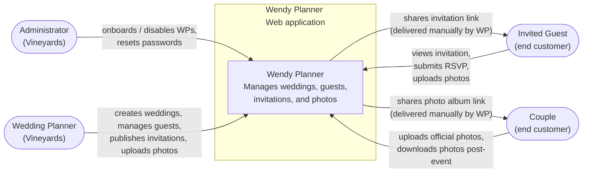

| Communication Partner | Inputs to System | Outputs from System |
|-----------------------|------------------|---------------------|
| Administrator | Create/disable WP accounts, reset passwords, view all owned weddings | Confirmation of account actions, audit events |
| Wedding Planner | Create weddings, manage guest list, select invitation template, upload official photos, generate couple/guest links | Published invitation link, photo album link, dashboard views |
| Couple | Upload official photos via shared link | Upload confirmation, post-event download link/USB |
| Invited Guest | View invitation, submit RSVP, optionally upload photos | Personalized invitation view, RSVP confirmation |

### 3.2 Technical Context

How each business exchange is realized technically.

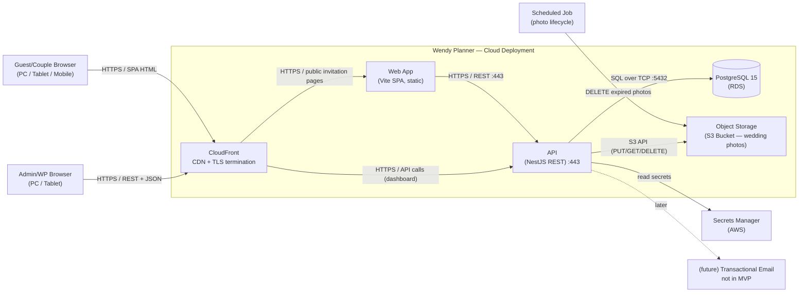

| Channel | From → To | Protocol | Format |
|---------|-----------|----------|--------|
| Admin/WP dashboard traffic | Browser → CDN → API | HTTPS/REST | JSON |
| Guest invitation page | Browser → CDN → Web App | HTTPS (SPA) | HTML + JS bundle |
| Auth token issuance | Web → API | HTTPS/REST (POST `/oauth/token`) | JSON (OAuth 2.0-style) |
| Auth discovery | Web → API | HTTPS (GET `/.well-known/wendy-configuration`) | JSON |
| Public signing keys | Web → API | HTTPS (GET `/.well-known/jwks.json`) | JSON (JWK Set) |
| Photo upload (official, by WP) | API → Object Storage | HTTPS / S3 API | Multipart (presigned URLs) |
| Photo upload (guest album) | API → Object Storage | HTTPS / S3 API | Multipart (presigned URLs) |
| Photo download (couple) | Browser → CDN → Object Storage | HTTPS | Streaming |
| Lifecycle deletion | Scheduler → Object Storage | AWS S3 Lifecycle Policy | Object-level rule |
| Database access | API → PostgreSQL | TCP/TLS | SQL (parameterized) |
| Secret retrieval | API → Secrets Manager | HTTPS | JSON |

---

## 4. Solution Strategy

A summary of the fundamental decisions that shape the architecture. Details live in §5–§9; full rationale lives in the ADRs.

| Quality Goal / Problem | Decision | Rationale |
|------------------------|----------|-----------|
| Time-to-MVP with 2-person team | **Modular monolith** in **TypeScript** end-to-end (NestJS + Vite/React) | One language across FE/BE reduces context-switching and shared types. Modular monolith avoids the ops and coordination cost of microservices. |
| Lightweight, simple-to-operate public invitation | **Vite + React SPA** with two route groups: `(dashboard)` authenticated, `(public)` lazy-loaded for `/i/:token`. Static deploy to S3 + CloudFront. No Node.js runtime for the FE. | No SSR/SEO needed (`noindex` per ADR-10); CloudFront caching + lazy route + skeleton give acceptable first paint; no Fargate cost for the FE. |
| Standardized data layer with future multi-tenancy | **PostgreSQL 15** as the single OLTP store, with `tenant_id` columns and bounded-context schemas | PostgreSQL is well-supported in both stacks, supports JSON for template data, and is the de-facto standard for this kind of workload. |
| Container-based cloud deployment with low ops overhead | **AWS ECS Fargate** for both the Web App and the API, plus **RDS PostgreSQL**, **S3**, **CloudFront**, **Secrets Manager**, **CloudWatch** | Containers satisfy TC-2; Fargate removes the K8s ops burden that 2 people cannot afford; AWS is the broadest, most documented option for the team. |
| Predictable cost and auto-deletion of photos | **S3 Lifecycle Policy** with `Expiration` set to `event_date + 30 days` per object prefix, plus a daily **scheduled job** as a safety net | Native S3 lifecycle is the cheapest, most reliable way to enforce TC-6. A scheduler is a backstop in case a wedding's `event_date` is updated. |
| Bilingual UI ready for more languages | **`i18next` + `react-i18next`** on the frontend; `Accept-Language` detection on first visit; user can override; framework-agnostic | Mature ecosystem; same mechanism scales to any number of locales; decoupled from the FE framework choice. |
| Versioned, peer-reviewed schema changes | **Prisma Migrate** as the single source of truth for DB schema + migrations; one-shot ECS task runs `prisma migrate deploy` before the API starts | Same tool as the ORM; SQL files in git; no drift between `schema.prisma` and migrations; ecosystem-native (Liquibase analog). |
| Velocity across FE/BE for a 2-person team | **Monorepo with `pnpm workspaces`** (`apps/api`, `apps/web`, `packages/contracts`) | Single PR can change API contract + FE consumer atomically; shared TS types via `@wendy/contracts`; ESLint boundary rules prevent coupling drift. |
| Secure, simple auth for ~10 WPs with future IdP portability | **JWT (access + refresh) with bcrypt-hashed passwords**, role-based authorization (`Administrator`, `WeddingPlanner`), exposed under OIDC-style URLs (`/.well-known/wendy-configuration`, `/oauth/token`, `/oauth/userinfo`, `/oauth/revoke`, `/oauth/user/password`, `/oauth/logout`), wired with **`@nestjs/passport` + `passport-jwt`** (RS256 + JWKS) | No IdP or SSO needed at this scale; bcrypt is the de-facto standard; JWT keeps the API stateless; the canonical NestJS recipe makes a future swap to Cognito / Auth0 / Keycloak a single-strategy change. |
| NestJS-native validation shared between API and forms | **`class-validator` + `class-transformer` + NestJS `ValidationPipe`**; DTO classes live in `@wendy/contracts` and are decorated once, used by both the API (server validation) and the FE (form validation via a tiny React Hook Form resolver adapter). The same pattern is used for typed config classes (ADR-16). | Canonical NestJS pattern; one source of truth for the contract (DTO = validation + typing + OpenAPI docs); no validation drift between FE and BE; config validated at boot, not at runtime. |
| Cost-conscious and reversible tech choices | Every significant choice has a **documented alternative** in the ADRs and a path to revisit | Reversibility is a first-class concern: no irreversible vendor lock-in before the MVP validates the product. |

---

## 5. Building Block View

### 5.1 Event Storming — Domain Decomposition

The MVP's domain events cluster into **six bounded contexts** that map directly to the modules of the modular monolith. This decomposition was derived from the kickoff's features, the glossary, and the project brief's in-scope items.

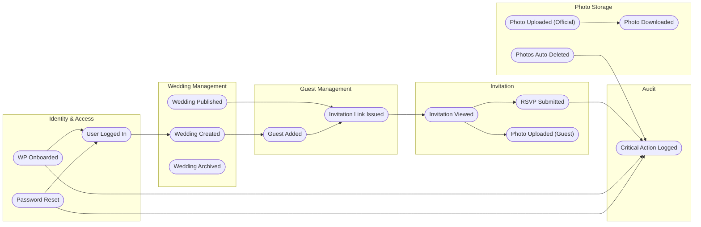

| Domain Event | Domain Object | Bounded Context |
|--------------|---------------|-----------------|
| WP Onboarded | `WeddingPlanner` | Identity & Access |
| User Logged In | `Session` | Identity & Access |
| Password Reset | `WeddingPlanner` | Identity & Access |
| Wedding Created | `Wedding` | Wedding Management |
| Wedding Published | `Wedding` | Wedding Management |
| Wedding Archived | `Wedding` | Wedding Management |
| Guest Added | `Guest`, `GuestGroup` | Guest Management |
| Invitation Link Issued | `InvitationToken` | Guest Management |
| Invitation Viewed | `InvitationView` | Invitation |
| RSVP Submitted | `RSVP` | Invitation |
| Photo Uploaded (Official) | `Photo` | Photo Storage |
| Photo Uploaded (Guest) | `GuestPhoto` | Invitation |
| Photo Downloaded | `DownloadEvent` | Photo Storage |
| Photos Auto-Deleted | `Wedding` | Photo Storage |
| Critical Action Logged | `AuditEvent` | Audit |

### 5.2 Container View (C4 Level 2)

The system is open: we see the top-level deployable units and how they communicate.

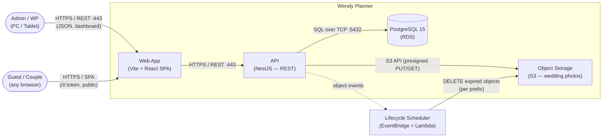

**Contained Building Blocks:**

| Name | Technology | Responsibility |
|------|------------|----------------|
| **Web App** | Vite 5 + React 19 + TypeScript 5.x (SPA, see ADR-02) | (1) Admin/WP dashboard with two route groups — `(dashboard)` authenticated, `(public)` lazy-loaded for `/i/:token`; (2) bilingual UI via `i18next` (ADR-08); (3) forms via React Hook Form + `class-validator` DTOs (shared with the API — ADR-14). |
| **API** | NestJS 11 (TypeScript, Node.js 22) | (1) REST endpoints for all bounded contexts; (2) JWT auth via OIDC-style URLs (ADR-05), wired with `@nestjs/passport` + `passport-jwt` (ADR-15), RBAC enforcement; (3) presigned S3 URL issuance; (4) input validation via NestJS `ValidationPipe` + `class-validator` DTOs (ADR-14); (5) audit logging; (6) health-check endpoints via `@nestjs/terminus` (ADR-17) at `/health/live` and `/health/ready`. |
| **PostgreSQL DB** | PostgreSQL 15 on AWS RDS | Single source of truth for users, weddings, guests, RSVPs, audit. Per-table `tenant_id` column. |
| **Object Storage** | AWS S3 bucket `wp-photos-prod` | Official photos and guest-uploaded photos. Lifecycle rule: delete 30 days after `wedding.event_date`. |
| **Static Web Hosting** | AWS S3 bucket `wp-web-static-prod` + CloudFront | Hosts the Vite-built `dist/` (HTML, JS, CSS, images). No Node.js runtime for the frontend. |
| **Lifecycle Scheduler** | Amazon EventBridge + Lambda (Node.js) | Daily safety-net scan: for any wedding whose `event_date + 30d` is in the past, ensure all S3 objects under its prefix are deleted. |
| **CDN** | AWS CloudFront (two distributions: one for the static web, one for the API + photo downloads) | TLS termination, caching of static assets and photo reads, signed URLs for protected photo downloads. |
| **Secrets Store** | AWS Secrets Manager | Database credentials, JWT signing keys, S3 access keys. |

**Important Interfaces:**

- **Public API** (v1): REST/JSON over HTTPS. Documented via OpenAPI 3 generated from NestJS decorators (`@nestjs/swagger`).
- **Web → API**: same-origin via rewrites in production; relative paths in dev. All calls authenticated except `POST /oauth/token` (login), `GET /.well-known/wendy-configuration`, `GET /.well-known/jwks.json`, and the public invitation/photo-album endpoints.
- **API → S3**: server-side generates presigned PUT/GET URLs; clients upload/download directly to/from S3 to avoid streaming through the API.
- **DB driver**: Prisma ORM with strict typing and migrations. No raw SQL outside migrations.
- **Error contract**: standard JSON error envelope `{ "code": string, "message": string, "details"?: object, "traceId": string }` for all API responses.

**Repository Layout (monorepo, see ADR-12):**

| Container | Path | Purpose |
|-----------|------|---------|
| Web App | `apps/web/` | Vite + React + TypeScript SPA. Two route groups: `(dashboard)` and `(public)`. |
| API | `apps/api/` | NestJS application; one folder per bounded context under `src/modules/`. DTOs imported from `@wendy/contracts`. |
| DB Schema & Migrations | `apps/api/prisma/` | `schema.prisma` + versioned `migrations/` (see ADR-11). |
| Shared contracts | `packages/contracts/` | DTO classes with `class-validator` decorators (see ADR-14) + branded ID types (see ADR-13) + a small React Hook Form resolver adapter. |

The boundary is enforced by ESLint rules: `apps/api` cannot import from `apps/web` (and vice versa); `packages/contracts` cannot import from `apps/*`. The `packages/contracts` `tsconfig.json` has `experimentalDecorators: true` and `emitDecoratorMetadata: true` so the same DTO classes work on both sides of the wire.

---

## 6. Runtime View

The critical scenarios that justify the architecture. Each scenario uses one trigger and shows only architectural participants (no classes or functions). The primary WP flows — onboarding, wedding capture, guest capture — are documented first because they are the core of the product.

### 6.1 Scenario 1 — Administrator Onboards a Wedding Planner

- **Trigger:** Administrator creates a new WP account with an assigned password.
- **Flow type:** Synchronous; followed by an asynchronous handoff of the credentials.
- **Architectural relevance:** Validates the Identity & Access bounded context, the `tenant_id` propagation (ADR-07), the audit trail for user creation, and the password-assignment semantics (the Admin-assigned password is the WP's **permanent** password; there is no forced rotation on first login — see ADR-05 §Decision).

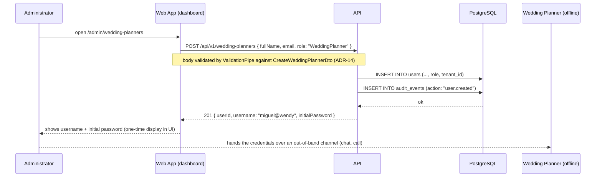

After the handoff, the WP logs in with `POST /oauth/token { grant_type: "password", username, password }`. The endpoint returns an access token (15 min) and a refresh token cookie. The same password works on every subsequent login.

### 6.2 Scenario 2 — Wedding Planner Captures the Wedding Data

- **Trigger:** WP creates a wedding, selects one of the 6 invitation templates, and fills in the data for the 14 invitation modules.
- **Flow type:** Synchronous (create + initial data save); followed by incremental saves as the WP fills each module.
- **Architectural relevance:** This is the **primary flow** of the MVP. Validates the Wedding Management bounded context, the per-template payload schema (JSONB), the `tenant_id` propagation, the S3 prefix provisioning for photos, and the bilingual data entry (wedding content entered once, in the WP's preferred locale, stored as-is).

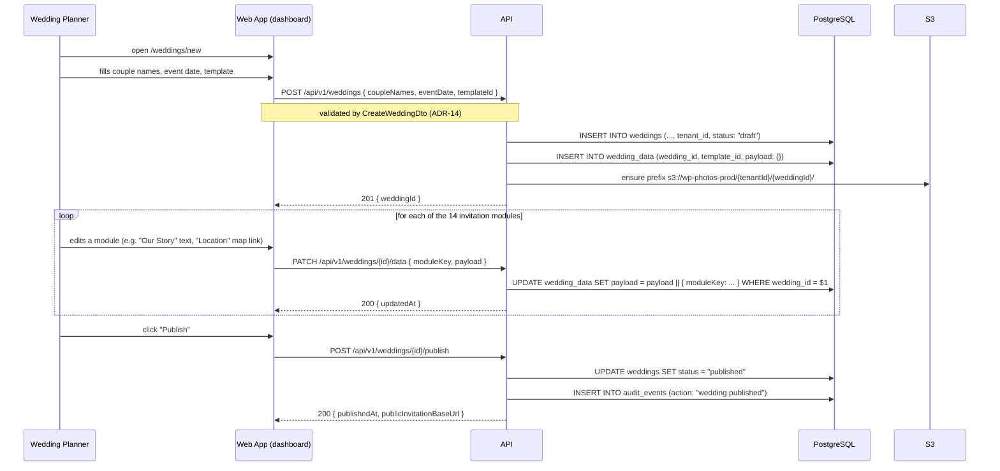

**The 14 invitation modules** (per the kickoff): Landing, Parents, Countdown, Our Story, Location, Program, Gallery, RSVP, Gift table / bank details, Dress code, Guest photo album, Accommodation, Contact, Per-guest invitation link. Each module's shape lives in `@wendy/contracts/dtos/weddings/modules/` as a typed DTO; the payload is merged into a single `wedding_data.payload` JSONB column.

### 6.3 Scenario 3 — Wedding Planner Captures the Guest List

- **Trigger:** WP creates guest groups (Bride side, Groom side, Family, etc.), adds guests to each group, and the system generates per-guest invitation links.
- **Flow type:** Synchronous; bulk operations are a single API call.
- **Architectural relevance:** Second **primary flow** of the MVP. Validates the Guest Management bounded context, the per-guest invitation tokens (signed JWTs with `aud: 'invitation'` — see ADR-10), and the tenant isolation.

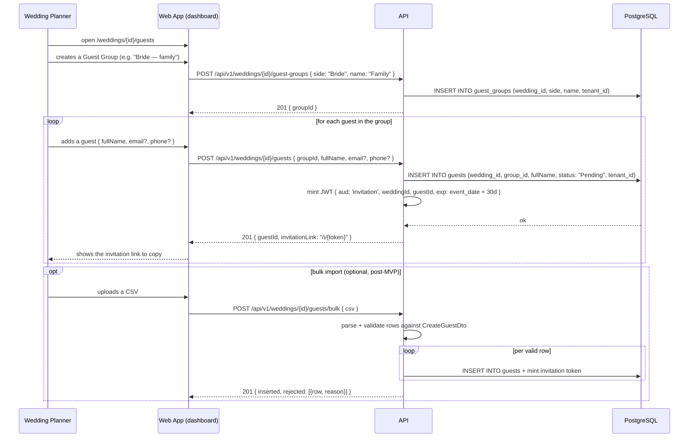

The WP copies each invitation link and sends it to the corresponding guest out-of-band (WhatsApp, SMS, email — out of scope for MVP per the kickoff).

### 6.4 Scenario 4 — Guest Accesses Invitation and Submits RSVP

- **Trigger:** Guest opens the per-guest invitation URL `/i/{token}`.
- **Flow type:** Synchronous; one page load and one POST.
- **Architectural relevance:** Validates the token-based public access, the lazy-loaded public route (ADR-02), the Guest Management → Invitation handoff, and the bilingual locale detection.

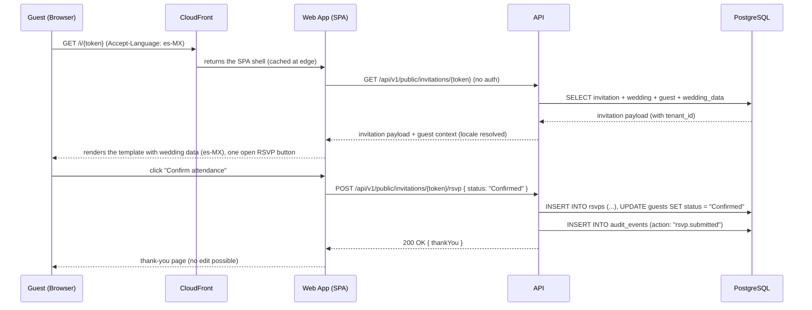

### 6.5 Scenario 5 — Couple Uploads Official Photos via Shared Link

- **Trigger:** Couple opens the shared link `/c/{token}` delivered by the WP.
- **Flow type:** Asynchronous upload via presigned URLs (one API call to authorize, one direct PUT to S3, one final API call to register).
- **Architectural relevance:** Validates the presigned-URL pattern, the 200-photo cap, the quality-tier choice, and the audit trail.

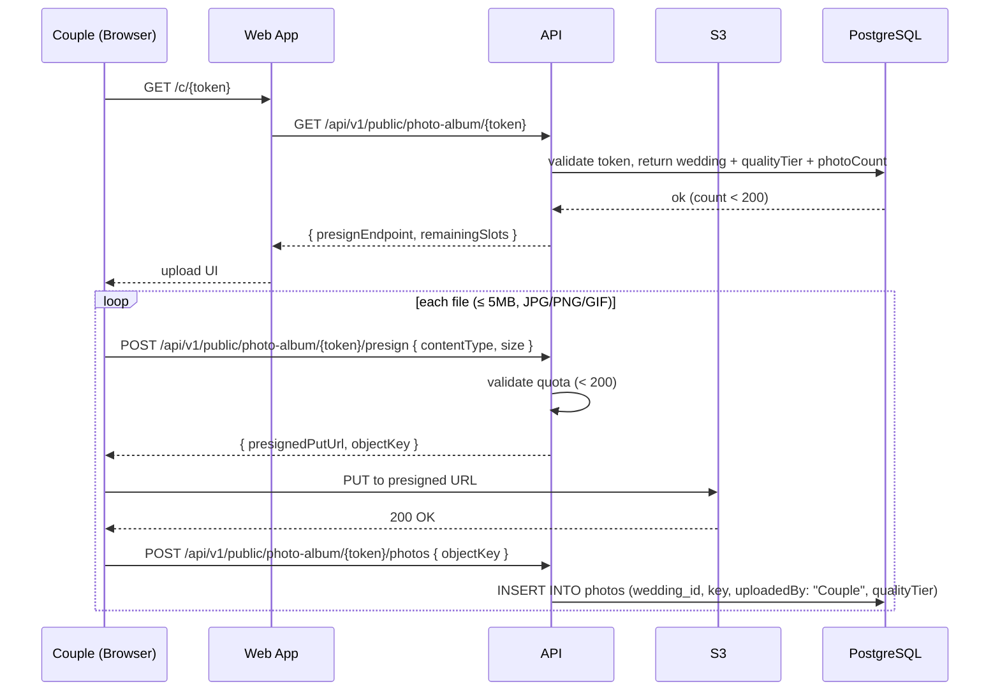

### 6.6 Scenario 6 — Photos Auto-Deleted 1 Month After Event Date

- **Trigger:** Scheduled (daily).
- **Flow type:** Asynchronous, two layers: a primary S3 Lifecycle Policy and a safety-net Lambda scan.
- **Architectural relevance:** Validates the cost-control strategy (TC-6) and the dual-layer reliability.

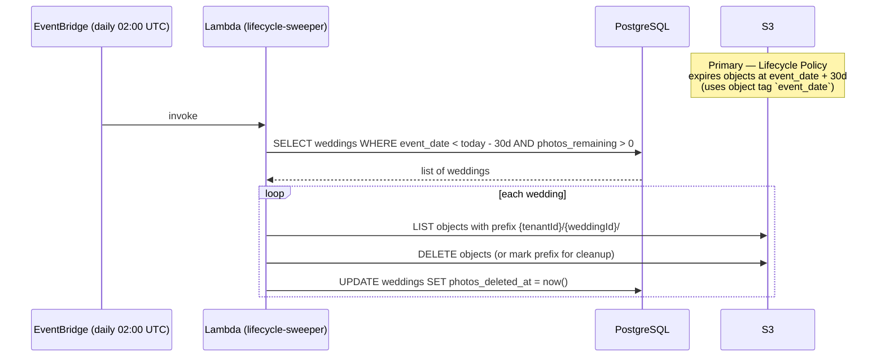

### 6.7 Notable Runtime Properties

- **Stateless API**: any container instance can serve any request; horizontal scale-out is trivial.
- **CSR for both surfaces**: the dashboard is fully client-rendered; the public invitation is also CSR but with a route bundle lazy-loaded so guests do not download dashboard code.
- **Validation is shared**: every write goes through `class-validator` DTOs from `@wendy/contracts` (ADR-14); the FE forms use the same DTOs.
- **No background workers in MVP**: the only scheduled task is the daily photo sweeper, which runs as a serverless Lambda.
- **Audit events** are written synchronously inside the same DB transaction as the action they record for critical operations (RSVP submission, password reset, photo deletion, account disable).

---

## 7. Deployment View

### 7.1 Infrastructure Level 1

A single AWS account, single region, with a minimal set of managed services. Fargate is preferred over EKS for the API; the frontend is **static assets on S3** behind CloudFront (no Node.js runtime for the FE, see ADR-02 v2).

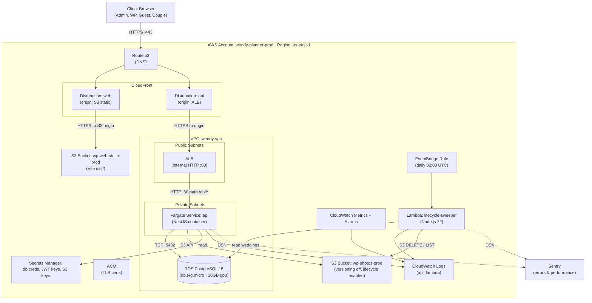

**Mapping of Building Blocks to Infrastructure:**

| Software (§5) | Infrastructure Resource | Type | Notes |
|---------------|------------------------|------|-------|
| Web App (Vite SPA) | S3 bucket `wp-web-static-prod` + CloudFront distribution `web` | S3 static hosting + CloudFront | `vite build` outputs `dist/`; deployed via `aws s3 sync` + CloudFront invalidation. No containers, no Node.js runtime for the FE. |
| API | Fargate Service `api` (2 tasks) | ECS Fargate | NestJS. Behind ALB on `/api/*`. Auto-scales on CPU. Health-checked by the ALB target group on `GET /health/ready` (ADR-17); restarted by ECS on `GET /health/live` failure. |
| PostgreSQL | RDS `wp-db-prod` (db.t4g.micro) | RDS PostgreSQL 15 | 20 GB gp3 storage. Single-AZ for MVP; multi-AZ is a one-click switch. |
| Object Storage (photos) | S3 bucket `wp-photos-prod` | S3 | Versioning off. Lifecycle policy: delete at `event_date + 30d`. |
| Lifecycle Scheduler | EventBridge + Lambda | Event-driven | Daily 02:00 UTC; idempotent. |
| Secrets | Secrets Manager | Managed | Rotated manually; integrated with ECS task definition. |
| CDN | Two CloudFront distributions | Managed | `web` (origin = S3 static), `api` (origin = ALB). Both with ACM TLS. |
| DNS | Route 53 hosted zone | Managed | Single domain (e.g. `wendy.app`); both distributions on the same zone. |
| TLS | ACM certificates | Managed | One per CloudFront distribution; auto-renewal. |
| Observability | CloudWatch Logs/Metrics, Sentry | Managed + SaaS | Alarms on 5xx rate, RDS CPU, Fargate CPU, S3 4xx DELETE. |

### 7.2 Environment Strategy

| Env | Purpose | Cost posture | Notes |
|-----|---------|--------------|-------|
| **dev** | Local development via `docker compose` for Postgres and a MinIO container for S3 emulation. Frontend runs via `pnpm dev` (Vite). | Zero | Each developer runs the full stack locally. |
| **staging** | Mirrors prod with `db.t4g.micro` and 1 Fargate task for the API. Static web uploaded to a staging S3 bucket + staging CloudFront distribution. | Low (~1/3 of prod) | Used for the 2 pilot weddings' dress rehearsal. |
| **prod** | As diagrammed above. | Bounded | First 2 pilot weddings run on staging until prod is hardened (week 11). |

---

## 8. Cross-cutting Concepts

Patterns that span multiple building blocks.

### 8.1 Authentication & Authorization

- **Framework:** `@nestjs/passport` + `passport-jwt` (see ADR-15). The `JwtStrategy` extracts the bearer token, verifies the RS256 signature against the public key served at `/.well-known/jwks.json`, and populates `req.user` with `{ id, role, tenantId }`. Public tokens (invitations, photo-album) are validated by a dedicated `PublicTokenStrategy` that checks the `aud` claim per route.
- **Strategy:** JWT-based stateless authentication with short-lived access tokens (15 min) and long-lived refresh tokens (7 days) stored in an `HttpOnly`, `Secure`, `SameSite=Lax` cookie.
- **Password storage:** bcrypt (cost factor 12) — the de-facto standard for Node.js in 2026.
- **Roles:** `Administrator`, `WeddingPlanner`. Authorization enforced at the NestJS guard level based on JWT claims.
- **Standards-aligned URLs** (see ADR-05): all auth endpoints follow OIDC-style paths under `/oauth/*` and `/.well-known/*`. The FE talks to the same URL paths that Cognito, Auth0, or Keycloak would expose — making a future IdP swap a backend-internal change.
  - `GET /.well-known/wendy-configuration` — discovery metadata (URL map).
  - `GET /.well-known/jwks.json` — public signing keys.
  - `POST /oauth/token` — issue access + refresh tokens (`grant_type=password`).
  - `POST /oauth/refresh` — exchange a refresh token for a new pair.
  - `POST /oauth/revoke` — revoke a refresh token (kills all derived access tokens).
  - `GET /oauth/userinfo` — return the authenticated user's profile.
  - `PUT /oauth/user/password` — self-service password change (authenticated).
  - `POST /oauth/logout` — revoke the current refresh token and clear the cookie.
- **Public endpoints:** `/api/v1/public/invitations/:token`, `/api/v1/public/photo-album/:token`, and `/api/v1/public/guest-photos/:token` require only a valid signed token; the token's claims carry the wedding ID, the allowed action, and an expiry (see ADR-10).
- **Initial admin (`admin@wendy`):** seeded at deploy time with a generated random password. The seed script logs the password once to a one-time secure channel (deployer's terminal or Secrets Manager). **This password is the admin's permanent password** — there is no forced rotation on first login.
- **WP password (assigned by Admin):** the value the Admin enters is stored bcrypt-hashed. The same password works on first login and every subsequent login. **No forced rotation on first login.** The WP can change it voluntarily via `PUT /oauth/user/password`.
- **No self-service password recovery** in MVP — Admin resets the password manually when needed.

### 8.2 Internationalization (i18n)

- **Frontend:** `i18next` + `react-i18next` + `i18next-browser-languagedetector` with message catalogs under `apps/web/src/i18n/locales/{en,es}/`. English is the default; Spanish auto-detected from `Accept-Language` on first visit; user can switch via a locale switcher (preference stored in a cookie).
- **Backend:** all user-facing strings (errors, validation messages) are emitted as codes; the frontend maps them. No server-side locale resolution needed.
- **Extensibility:** adding a third locale (e.g. Portuguese) is a matter of adding a JSON file under `locales/` and registering the locale in `i18next` config.

### 8.3 Error Handling & Logging

- **API error envelope:** `{ code, message, details?, traceId }`. `traceId` correlates the request across Web, API, and DB logs.
- **Logging:** structured JSON to stdout in every container; aggregated by CloudWatch Logs. Levels: `debug`, `info`, `warn`, `error`.
- **Error reporting:** Sentry captures unhandled exceptions in Web, API, and Lambda with the `traceId` as a tag.

### 8.4 Configuration Management

- **Pattern:** typed config classes (Pydantic-settings / Spring `@ConfigurationProperties` style — see ADR-16). One class per config domain (`DatabaseConfig`, `JwtConfig`, `S3Config`, `AwsConfig`, `AppConfig`, `PhotoLifecycleConfig`, etc.), each decorated with `class-validator` constraints, each loaded from `process.env` via a `static fromEnv()` factory at startup.
- **Validation:** config classes are validated at boot. A missing or malformed env var crashes the app immediately with a clear error message (`[DatabaseConfig] validation failed: - password: should not be empty`), not a runtime 500 six hours later.
- **DI:** the global `AppConfigModule` provides each config class via `useFactory`. Services and controllers inject the class by type (`constructor(private readonly db: DatabaseConfig)`) — no string keys, no `process.env` lookups scattered through the code.
- **`.env` loading (dev only):** `@nestjs/config`'s `ConfigModule.forRoot({ envFilePath: '.env', isGlobal: true })` runs first, populates `process.env`, then our typed factories read from there. In prod (ECS), env vars come from the task definition directly — no `.env` file is loaded.
- **Secrets:** values that are secrets (DB password, JWT private key, S3 access keys) are injected as env vars from **AWS Secrets Manager** at ECS task start. They flow through the same typed config classes as everything else; the classes don't need to know whether the value came from Secrets Manager or a plain env var.
- **Self-documenting:** `apps/api/src/config/` is the full inventory of env vars the app reads. New developers see the schema in one folder.
- **Testable:** tests instantiate the config class with test values; no need to set `process.env`.
- **Per-environment values:** `dev`, `staging`, `prod` — switched by the deploy pipeline (the CI/CD stage sets the env vars per environment).

### 8.5 Data Validation

- **Library:** `class-validator` + `class-transformer` (see ADR-14).
- **Single source of truth:** DTO classes with `class-validator` decorators live in `@wendy/contracts` (monorepo `packages/contracts/src/dtos/`, see ADR-12) and are reused on both API and Web. This eliminates drift between request payloads and form inputs.
- **Server-side:** a global NestJS `ValidationPipe` validates every incoming body against the DTO declared as the controller parameter. The pipe uses `whitelist: true`, `forbidNonWhitelisted: true`, and `transform: true`. Errors come back as `BadRequestException` with one entry per failed constraint; the FE maps each constraint name to a localized message via `i18next`.
- **Client-side:** React Hook Form uses a tiny custom resolver adapter (`@wendy/contracts/fe-adapter/classValidatorResolver`) that constructs the DTO from form values and calls `validate()` from `class-validator`. Same decorators, same rules, same errors.
- **Bonus — OpenAPI:** `@nestjs/swagger`'s CLI plugin derives the `@ApiProperty()` decorators from `class-validator` decorators, so the OpenAPI schema is generated automatically. One set of DTOs serves validation, typing, and documentation.

### 8.6 Audit Logging

- **What is audited:** user onboarding/disable, password reset, wedding publish/archive, photo upload/download, photo auto-deletion, RSVP submission.
- **How:** an `AuditEvent` row is written **in the same DB transaction** as the action. Logs are append-only (no UPDATE, no DELETE from the application code path).

### 8.7 Photo Lifecycle Enforcement (Defense in Depth)

- **Layer 1 (primary):** S3 Lifecycle Policy using an object tag `event_date=YYYY-MM-DD`; objects expire `event_date + 30d`.
- **Layer 2 (safety net):** daily Lambda scan that reconciles DB and S3 — if a wedding's `event_date + 30d` has passed, the Lambda deletes remaining objects and marks the wedding as `photos_deleted_at`.
- **Why both:** native S3 lifecycle is the cheapest mechanism; the Lambda covers edge cases (retrospective event-date changes, S3 eventual consistency).

### 8.8 CI/CD

- **Pipeline:** GitHub Actions → per-target deploys (ECR + ECS for the API; S3 + CloudFront for the static web).
- **Change detection:** the pipeline diffs the monorepo and runs the relevant jobs only — `apps/api` changed triggers API tests + image build + ECS rolling deploy, `apps/web` triggers Web tests + `vite build` + S3 sync + CloudFront invalidation, `packages/contracts` changed triggers both dependents (see ADR-12).
- **Stages (API):** `lint` → `typecheck` → `unit tests` → `integration tests` → `build image` → `push to ECR` → `deploy to staging` → `smoke tests` → `manual approval` → `deploy to prod`.
- **Stages (Web):** `lint` → `typecheck` → `unit tests` → `vite build` → `aws s3 sync dist/ s3://wp-web-static-{env}/` → `aws cloudfront create-invalidation`.
- **Migrations:** Prisma migrations run as a one-shot ECS task before the new API service tasks start (see ADR-11). The migration task uses `prisma migrate deploy` against the target database.

### 8.9 Observability

- **Metrics:** request rate, p50/p95/p99 latency, 5xx rate, DB connections, Fargate CPU, S3 4xx DELETE count.
- **Alarms:** page the on-call developer (PagerDuty free tier or Opsgenie trial) on 5xx > 1% over 5 min, RDS CPU > 80% over 10 min, Fargate task health failing.
- **Dashboards:** one CloudWatch dashboard per environment.

### 8.10 Health Checks

- **Library:** `@nestjs/terminus` (see ADR-17).
- **Endpoints:**
  - `GET /health/live` — liveness probe. Cheap. Returns 200 if the process is alive and memory is within bounds (heap ≤ 200 MB, RSS ≤ 300 MB). ECS uses this to detect a crashed or deadlocked container and restart it.
  - `GET /health/ready` — readiness probe. Returns 200 only when downstream dependencies are reachable: Prisma (`SELECT 1` against PostgreSQL with 1 s timeout), S3 (`HeadBucket` against the photo bucket with 2 s timeout), memory + disk checks. The ALB uses this to gate traffic; an unhealthy task is taken out of rotation immediately and replaced.
- **Custom indicators:** `PrismaHealthIndicator` (the bundled TypeORM indicator doesn't apply — we use Prisma) and `S3HealthIndicator` (Terminus doesn't ship one). Both wrap external calls with a timeout and throw `HealthCheckError` on failure so the response shape is consistent.
- **Auth:** `/health/*` are unauthenticated by design (orchestrators and ALBs must reach them without credentials). No secrets are leaked — the response body reveals only "healthy" or "unhealthy with a brief reason".
- **Why split liveness from readiness:** during a brief DB blip, readiness fails (no traffic sent) but liveness still passes (no container restart). Conflating them would cause a restart loop.
- **ECS wiring:** ALB target group health check on `/health/ready` (interval 30 s, timeout 5 s, healthy threshold 2, unhealthy threshold 3). ECS container health check on `/health/live` (interval 30 s, retries 3).

---

## 9. Architecture Decisions

Significant decisions are captured as standalone ADRs in `3-architecture/3.3-decision-record/`. This section is the index.

| ID | Decision | Status | Date | ADR File | Rationale (one-liner) |
|----|----------|--------|------|----------|------------------------|
| AD-01 | Backend stack: **NestJS (Node.js + TypeScript)** | Accepted | 2026-08-10 | [adr-01-backend-stack-nestjs.md](../3.3-decision-record/adr-01-backend-stack-nestjs.md) | Single language end-to-end, faster iteration for 2-person team. |
| AD-02 | Frontend stack: **Vite + React + TypeScript (SPA)** | Accepted (v2.0.0) | 2026-08-10 | [adr-02-frontend-stack-vite-react.md](../3.3-decision-record/adr-02-frontend-stack-vite-react.md) | Lightweight SPA; static deploy on S3 + CloudFront; no Node.js runtime for the FE. |
| AD-03 | Database: **PostgreSQL 15 on AWS RDS** | Accepted | 2026-08-10 | [adr-03-database-postgresql-rds.md](../3.3-decision-record/adr-03-database-postgresql-rds.md) | Proven, JSON support, easy multi-tenancy prep, broad team familiarity. |
| AD-04 | Cloud topology: **AWS ECS Fargate + RDS + S3 + CloudFront** | Accepted | 2026-08-10 | [adr-04-cloud-aws-ecs-fargate.md](../3.3-decision-record/adr-04-cloud-aws-ecs-fargate.md) | Containers without K8s ops; managed services; pay-per-use. |
| AD-05 | Authentication: **JWT (access + refresh) + bcrypt + OIDC-style URLs** | Accepted (v2.0.0) | 2026-08-10 | [adr-05-auth-jwt-bcrypt.md](../3.3-decision-record/adr-05-auth-jwt-bcrypt.md) | Stateless API; standards-aligned URL paths make a future IdP swap a backend-internal change. |
| AD-06 | Photo storage & lifecycle: **S3 + Lifecycle Policy + Lambda sweeper** | Accepted | 2026-08-10 | [adr-06-photo-storage-s3-lifecycle.md](../3.3-decision-record/adr-06-photo-storage-s3-lifecycle.md) | Cheapest reliable mechanism for TC-6 with a safety net. |
| AD-07 | Multi-tenancy: **`tenant_id` column from day 1, no RLS** | Accepted | 2026-08-10 | [adr-07-multitenancy-preparation.md](../3.3-decision-record/adr-07-multitenancy-preparation.md) | Schema-only preparation, no MVP overhead. |
| AD-08 | i18n: **`i18next` + `react-i18next` + `Accept-Language`** | Accepted (v2.0.0) | 2026-08-10 | [adr-08-i18n-i18next.md](../3.3-decision-record/adr-08-i18n-i18next.md) | Framework-agnostic i18n; ready for more locales. |
| AD-09 | Modular monolith organization: **NestJS modules per bounded context** | Accepted | 2026-08-10 | [adr-09-modular-monolith-organization.md](../3.3-decision-record/adr-09-modular-monolith-organization.md) | One deployable unit, clear internal boundaries. |
| AD-10 | Public invitation URL strategy: **path-based `/i/:token`** | Accepted | 2026-08-10 | [adr-10-invitation-url-strategy.md](../3.3-decision-record/adr-10-invitation-url-strategy.md) | Simplest, shareable, no DNS overhead. |
| AD-11 | Database versioning: **Prisma Migrate** | Accepted | 2026-08-10 | [adr-11-database-versioning-prisma-migrate.md](../3.3-decision-record/adr-11-database-versioning-prisma-migrate.md) | Single source of truth (`schema.prisma`); versioned SQL in git; Liquibase analog in the TS ecosystem. |
| AD-12 | Repository strategy: **monorepo with `pnpm workspaces`** | Accepted | 2026-08-10 | [adr-12-monorepo-pnpm-workspaces.md](../3.3-decision-record/adr-12-monorepo-pnpm-workspaces.md) | Atomic FE/BE changes; shared types via `@wendy/contracts`; one repo to clone. |
| AD-13 | ID generation: **NanoId (10 chars, URL-safe)** | Accepted | 2026-08-10 | [adr-13-id-strategy-nanoid.md](../3.3-decision-record/adr-13-id-strategy-nanoid.md) | Shortest URL-friendly IDs; same lib on FE+BE; sort by `created_at`. |
| AD-14 | Validation library: **`class-validator` + `class-transformer` + NestJS `ValidationPipe`** | Accepted | 2026-08-10 | [adr-14-validation-class-validator.md](../3.3-decision-record/adr-14-validation-class-validator.md) | Canonical NestJS pattern; DTOs in `@wendy/contracts` shared with FE forms; ~45 KB cost in FE bundle. |
| AD-15 | Auth framework: **`@nestjs/passport` + `passport-jwt`** | Accepted | 2026-08-10 | [adr-15-auth-framework-passport.md](../3.3-decision-record/adr-15-auth-framework-passport.md) | Canonical NestJS recipe; trivial future swap to Cognito/Auth0 by changing the strategy; RS256 + JWKS. |
| AD-16 | Configuration: **typed config classes** (Pydantic-settings / `@ConfigurationProperties` style) | Accepted | 2026-08-10 | [adr-16-configuration-typed-classes.md](../3.3-decision-record/adr-16-configuration-typed-classes.md) | One `class-validator` class per config domain; validated at boot; injected by type; no `process.env` scattering. |
| AD-17 | Health checks: **`@nestjs/terminus`** | Accepted | 2026-08-10 | [adr-17-health-checks-terminus.md](../3.3-decision-record/adr-17-health-checks-terminus.md) | `/health/live` + `/health/ready` with custom Prisma and S3 indicators; ECS replaces unhealthy tasks automatically. |

---

## 10. Quality Requirements

### 10.1 Quality Requirements Overview

| Category (ISO 25010) | Quality Attribute | Description |
|----------------------|-------------------|-------------|
| Functional Suitability | **Operational completeness** | All ASRs in §1.2 are implementable with the chosen stack. |
| Performance Efficiency | **Time to first paint (public invitation)** | P95 ≤ 1.5 s to interactive on a 10 Mbps connection for the SPA bundle of `/i/:token` (cache MISS); ≤ 0.5 s on cache HIT. |
| Performance Efficiency | **API latency** | P95 ≤ 300 ms for dashboard endpoints under normal load (≤ 50 concurrent users). |
| Compatibility | **Browser compatibility** | Latest 2 versions of Chrome, Edge, Firefox, Safari on PC and tablet. |
| Usability | **Bilingual UI** | 100% of user-facing strings localized in EN and ES; locale switchable. |
| Usability | **Bilingual invitation content** | WP enters wedding data once; invitation renders in guest's locale. |
| Reliability | **Photo lifecycle enforcement** | 100% of photos deleted by `event_date + 30d + 24h` (allowing for daily sweep). |
| Reliability | **Availability (invitation endpoints)** | ≥ 99.5% during the 24 h before/after a wedding. |
| Security | **Authentication** | All non-public endpoints require a valid JWT. |
| Security | **Authorization** | RBAC enforced on every protected endpoint; no horizontal access between WPs. |
| Security | **Public link integrity** | Invitation/photo-album tokens are signed, single-purpose, and expire after the wedding. |
| Security | **Data at rest** | RDS encrypted at rest (AWS-managed key); S3 encrypted with SSE-S3. |
| Security | **Data in transit** | TLS 1.2+ everywhere (ALB, CloudFront, RDS connections). |
| Maintainability | **Codebase navigability** | A new developer can locate a feature by bounded context name in ≤ 5 minutes. |
| Maintainability | **Build determinism** | `pnpm install --frozen-lockfile` + pinned Node.js 22 LTS in CI. |
| Portability | **Cloud-portable** | Application containers run on any OCI-compatible runtime; no AWS-specific code in the Web or API containers. |
| Cost | **Recurring infra cost** | ≤ a low-hundreds USD/month while supporting 10 WPs and ~100 weddings/year. |

### 10.2 Quality Scenarios

| ID | Scenario Name | Source | Stimulus | Environment | Artifact | Response | Measure |
|----|---------------|--------|----------|-------------|----------|----------|---------|
| QS-01 | Cold invitation load | BG-3 | First-time guest opens `/i/{token}` | Production, 10 Mbps, PC | Web App (Vite SPA + CloudFront cache) | Public route bundle fetched and rendered | P95 ≤ 1.5 s to interactive (cache MISS) / P95 ≤ 0.5 s (cache HIT) |
| QS-02 | WP dashboard responsiveness | BG-1 | WP loads dashboard with 20 weddings | Production, 1 WPs concurrently | Web App | Dashboard rendered | P95 ≤ 1.5 s to interactive |
| QS-03 | Photo deletion enforcement | TC-6 | Time passes past `event_date + 30d` | Production | S3 + Lambda | All objects under the wedding's prefix are gone | 100% deleted within 24h |
| QS-04 | Horizontal WP access denied | Security | WP A attempts to read WP B's wedding | Production | API | 403 Forbidden | 100% blocked |
| QS-05 | Public token reuse after expiry | Security | Guest attempts to reuse an expired RSVP token | Production | API | 410 Gone | 100% rejected |
| QS-06 | Locale fallback | Usability | Guest with `Accept-Language: fr-FR` opens invitation | Production | Web App | Renders in English (default) | 100% fallback |
| QS-07 | Photo upload cap | TC-7 | WP attempts to upload the 201st photo | Production | API | 422 with `QUOTA_EXCEEDED` | 100% rejected |
| QS-08 | Tenant isolation readiness | TC-4 | Code review / future RLS rollout | All envs | DB | Every relevant table has `tenant_id NOT NULL` | 100% coverage |
| QS-09 | Build reproducibility | Maintainability | CI runs `pnpm install` | CI | Build artifacts | Same image hash as last green build | 100% reproducible |
| QS-10 | Bilingual content parity | TC-5 | Comparison of EN vs ES catalogs | Staging | `i18next` catalogs | Zero missing keys in either locale | 0 missing keys |

---

## 11. Risks and Technical Debts

Risks and known debts with explicit mitigations.

| Priority | Risk / Technical Debt | Probability | Impact | Mitigation Strategy |
|----------|-----------------------|-------------|--------|---------------------|
| **High** | **PO availability TBD** — without a Product Owner, prioritization stalls and we ship the wrong thing. | High | High | (1) Treat as a release-blocker until PO is assigned; (2) document explicit "If PO is unavailable for >5 business days, scope freezes" rule. |
| **High** | **Backend stack not validated with Vineyards** — NestJS vs Spring Boot 4 was a precondition, not yet a decision. | Medium | High | (1) Run a 2-day spike in sprint 1 comparing both stacks against ASR-1..ASR-7; (2) confirm in writing before sprint 2 starts. |
| **High** | **2 pilot weddings not scheduled within MVP window** — the success metric requires 2 real weddings between 2026-08-10 and 2026-11-10. | Medium | High | (1) Confirm dates with Vineyards by end of sprint 1; (2) if dates slip, request a 2-week no-cost extension. |
| **High** | **Photo storage cost overrun** — high-quality photos at 200/wedding could exceed the cost budget. | Medium | Medium | (1) Default to **Low** quality for new weddings; (2) document the cost-per-wedding per tier; (3) cap is already enforced (200 photos). |
| Medium | **No multi-tenancy enforcement** — accidental cross-tenant data exposure is possible if a developer forgets to filter by `tenant_id`. | Low (MVP) | High (future) | (1) All repository methods take `tenantId` explicitly; (2) add an integration test asserting per-tenant isolation; (3) defer RLS to a later iteration. |
| Medium | **No self-service password recovery** — single point of friction; if the only Admin is locked out, the system is stuck. | Low | High | (1) Document a manual recovery runbook; (2) store a break-glass admin password in a password manager owned by Vineyards. |
| Medium | **JWT secret rotation is manual** — rotation needs a coordinated restart. | Low | Medium | (1) Support two active signing keys during rotation; (2) document the rotation runbook. |
| Medium | **Bilingual content drift** — code text added in EN but not in ES. | Medium | Low | (1) CI step that fails the build if any locale catalog has missing keys. |
| Medium | **Couple's shared link leaks** — if the WP sends it over an insecure channel, anyone can upload. | Medium | Medium | (1) Tokens are per-wedding, expire after the wedding; (2) WP can rotate the token; (3) max 200 photos and 5 MB per file cap the blast radius. |
| Low | **Public invitation first paint depends on JS execution** — guests on slow networks may see a ~1-1.5s blank window before React hydrates. | Low | Medium | (1) Inline a skeleton in `index.html`; (2) lazy-load the route bundle; (3) CloudFront caches the static assets at the edge; (4) escape hatch: NestJS SSR via `react-dom/server` (ADR-02 §Option B) if measurements show >1.5s first paint on real devices. |
| Low | **No native mobile experience** — guests on phones can use the site but it's not optimized. | High (some guests will be on mobile) | Low | (1) Responsive design is still applied; (2) document that mobile-first is a future iteration. |
| Low | **No automated reminder emails** — if a guest loses the link, the WP must re-send. | Medium | Low | (1) Documented as out of scope; (2) WP can re-share the link from the dashboard. |
| Low | **AWS account lock-in** — Postgres, S3, and Lambda are all AWS-specific at the deployment layer. | Low | Medium | (1) Application code is portable (Prisma + OCI containers); (2) switching cloud is a deployment-time decision, not a code rewrite. |

---

## 12. Panel Review Summary

> Self-review by the author in lieu of a multi-agent panel. A formal panel review can be added in a later iteration if the team grows.

| Section | Key Improvements | Consensus Issues Resolved | Specialist Issues Added | Impact |
|---------|------------------|---------------------------|-------------------------|--------|
| 1. Introduction & Goals | Aligned 4 business goals with the Project Brief; selected 5 quality goals in priority order. | — | Added "Time-to-MVP" as priority 1 (specific to a 2-person team). | Medium |
| 2. Architecture Constraints | Mapped every kickoff constraint to an ID; split into Technical, Organizational, Conventions. | — | Added cost-conscious and engagement model as organizational constraints. | Medium |
| 3. Context & Scope | Two views (business + technical) with diagrams and channel table. | — | Added the Lifecycle Scheduler as a first-class technical actor. | High |
| 4. Solution Strategy | Each row links a quality goal to a decision and a rationale. | — | Surfaced the "reversibility" principle explicitly. | Medium |
| 5. Building Block View | Event-storming table + C4 L2 container diagram; explicit bounded contexts. | — | "Lifecycle Scheduler" added to the container table. | High |
| 6. Runtime View | 6 scenarios covering all primary WP flows (onboarding, wedding capture, guest list capture) + guest/couple/scheduler flows. | — | Split WP onboarding from wedding capture; added guest list capture as a primary flow; added photo auto-deletion. | High |
| 7. Deployment View | Single-region AWS; dev via docker compose, staging mirrors prod, prod budget-bounded. | — | Added "Environment Strategy" subsection. | High |
| 8. Cross-cutting Concepts | 9 concepts with concrete patterns (class-validator shared DTOs, OIDC-style URLs, Sentry tags, lifecycle in depth). | — | "Defense in depth" for photo lifecycle called out. | Medium |
| 9. Architecture Decisions | 15 ADRs as external files; index links each one and notes the revision status of evolved decisions. | — | ADR-02 (Vite over Next.js), ADR-05 (OIDC URLs), ADR-08 (i18next), ADR-11 (Prisma) all reached v2.0.0 after architecture review. | Medium |
| 10. Quality Requirements | All ISO 25010 categories covered; 10 measurable scenarios. | — | Added "Portability" and "Cost" rows. | Medium |
| 11. Risks & Technical Debts | 13 risks prioritized; every High risk has a concrete mitigation owner. | — | Surfaced PO availability as the most critical risk. | High |

### Executive Summary

**No critical issues found during self-review.** The document is internally consistent: the solution strategy in §4 maps to the containers in §5, which map to the infrastructure in §7, and the quality goals in §1.3 are echoed as measurable scenarios in §10.2. The most consequential decisions (backend stack, cloud topology, photo lifecycle) are explicitly reversible, which is appropriate for a 3-month MVP with a 2-person team. The biggest open risk is the still-unconfirmed PO availability and backend stack choice — both are tracked in §11 with release-blocking mitigations. **Readiness: the document is fit to guide the first technical session with Vineyards and to seed sprint 1 planning.**

---

*End of architecture document.*
