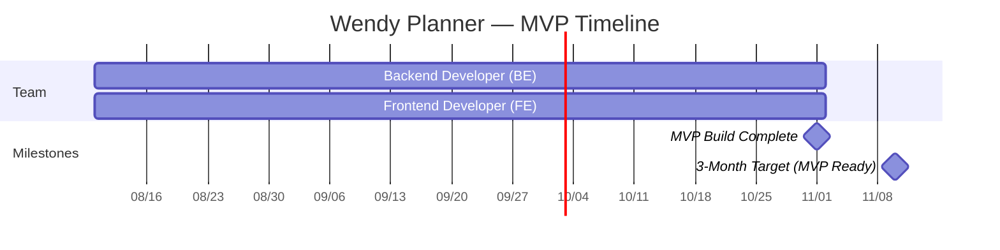

# Wendy Planner

## Project Overview

Wendy Planner is a web application that enables Wedding Planners (WPs) to manage every aspect of a wedding — from the couple's basic information and guest list to a public online invitation and post-event photo storage. The product is being built for Vineyards, a wedding planning organization with approximately 10 in-house Wedding Planners handling 4–10 weddings per year each.

Today, each WP at Vineyards administers weddings manually: they coordinate event details, select venues, contract vendors, and manage budgets using Excel files, and each WP follows their own process. The lack of standardization creates inefficiency, prevents consistent quality across WPs, and makes it difficult to scale the operation as the team grows.

This project delivers an MVP whose purpose is to validate that the most repetitive parts of a WP's workflow can be standardized into a single tool. If the MVP succeeds, features such as budget and vendor management will be added in subsequent iterations. The MVP success metric is the complete end-to-end capture of **2 real weddings** — from WP onboarding and wedding creation, through published invitation and RSVPs, to post-event photo download.

The solution is intentionally kept simple: a modular monolith deployed in containers on a cloud provider, built by a 2-person team (1 backend + 1 frontend), with cost-conscious technical decisions and an architecture that leaves room to grow.

## Project Challenges

### Current Situation

- **Manual, fragmented workflow:** Each WP coordinates weddings using personal Excel files and follows an idiosyncratic process, making it impossible to enforce quality standards or share best practices across the team.
- **No reusable tooling:** Common artifacts (guest lists, invitations, photo collections) are rebuilt from scratch for every wedding because there is no shared system.
- **Scaling bottleneck:** With 10 WPs handling up to ~100 weddings per year in aggregate, manual coordination is the limiting factor for growth.
- **No auditability:** Without a centralized system, it is hard to know the status of any given wedding or to extract operational metrics.

### Critical Risk

If Vineyards continues managing weddings with Excel and ad-hoc processes, growth beyond the current team size will be blocked by manual coordination overhead. Standardizing the core workflow is a prerequisite for scaling the business and for delivering consistent quality across WPs.

## Kickoff Docs

| Name | Goal | Location |
|------|------|----------|
| Kickoff — Wendy Planner | Initial project context, scope, constraints, and pending preconditions | [kickoff.md](1-management/1.1-kickoff/kickoff.md) |

## Proposal

The proposed solution is a monolithic, modular web application deployed in containers on a cloud provider. The MVP focuses on the minimum set of capabilities needed to run a wedding end-to-end inside the platform: wedding data capture, guest list management with RSVP, online invitation, and post-event photo storage.

A scope simplification agreed with the client for this first version: instead of offering WP-driven module selection for the invitation, the MVP ships **6 fixed, generic invitation templates**. The WP picks one of the six templates and the platform fills it with the wedding's data. No per-wedding customization of the invitation layout is planned for the MVP.

The architecture is intentionally simple — modular monolith, not microservices — so the small team can deliver within the 3-month MVP target while keeping the door open for future iterations (multi-tenancy, additional modules, more languages).

### Project Objectives

#### 1. Validate standardization with 2 end-to-end pilot weddings

Ship an MVP that supports the full lifecycle of a wedding inside the platform, then validate it by capturing 2 real weddings end-to-end — from WP onboarding, wedding creation, published invitation, and RSVPs, to post-event photo download.

#### 2. Replace the Excel-based workflow for the in-scope capabilities

Eliminate Excel for the in-scope MVP workflows (wedding data capture, guest list, invitation, photos) so that WPs work inside a single shared tool.

#### 3. Deliver within 3 months with a 2-person team

Ship a working MVP using 1 backend developer and 1 frontend developer, making cost-conscious technical decisions while preserving the ability to scale and iterate after the MVP.

#### 4. Build a foundation that supports future iterations

Make architectural choices (schema with `tenant_id`, i18n-ready UI, modular monolith) that allow adding features such as budget and vendor management in subsequent iterations without rework.

## Deliverables

### Outputs

- **Wendy Planner web application** — monolithic, modular, containerized, deployed to the cloud.
- **6 generic online invitation templates** — fixed designs covering the standard modules (landing, story, location, schedule, dress code, gifts, RSVP, gallery, contact); data is parameterized per wedding.
- **Guest list and RSVP module** — CRUD for invited guests and a public RSVP flow triggered by per-guest invitation links.
- **Photo storage subsystem** — configurable high/low upload quality, maximum 200 photos per wedding, automatic deletion 1 month after the event date.
- **Authentication and role management** — Administrator and Wedding Planner roles, credentials of the form `nombre@wendy`, password assigned by the Administrator.
- **Bilingual UI** — English (default) and Spanish, auto-detected via `Accept-Language`, architecture ready for additional languages.
- **Technical documentation** — architecture, blueprints, ADRs, and runbooks produced during the engagement.

### Outcomes

- **Standardized core workflow** — all WPs at Vineyards follow the same process for the in-scope capabilities, so operational consistency and quality are no longer dependent on individual habits.
- **Elimination of Excel for the in-scope flows** — guest lists, invitations, and photo collections live in the platform, removing version-control and handoff issues.
- **Validated scalability assumption** — the MVP demonstrates that the standardized workflow works for 2 real weddings, supporting the case for scaling to all ~10 WPs and ~100 weddings per year.
- **Ready-to-extend platform** — adding budget, vendors, or other modules in later iterations does not require rewriting the MVP foundation.

### What's Out of Scope

- Budget management.
- Vendor management.
- Email notifications (invitation links are delivered manually by the WP in the MVP).
- Self-service password recovery.
- Mobile-first experience (the MVP targets PC and tablet only).
- Migration of historical data from existing Excel files.
- Multi-tenancy implementation (the database schema will include a `tenant_id` column, but isolation is not enforced in the MVP).
- Automatic versioning of invitations when content is edited.
- Automated re-sending of invitations and reminders.
- **Per-wedding customization of invitation layout** — replaced by 6 fixed templates.

## Stakeholders

| Name | Contact | Role | Company |
|------|---------|------|---------|
| TBD | TBD | Product Owner | Vineyards |

> [!IMPORTANT]
> The kickoff lists the Product Owner / client contact (name, hours per week, response SLA for team questions) as a pending precondition. The Stakeholders table will be completed once that information is provided by Vineyards.

## Team Members

| Name | Contact | Role | Company | Responsibilities |
|------|---------|------|---------|------------------|
| TBD | TBD | Backend Developer | Delivery team | Backend implementation, API design, database schema, deployment configuration |
| TBD | TBD | Frontend Developer | Delivery team | Frontend implementation, invitation templates, i18n, UX for PC and tablet |

> [!NOTE]
> The engagement is staffed with 2 developers (1 backend + 1 frontend). Names and contacts will be filled in once the team is confirmed.

## Timeline and Effort Allocation

- **Duration:** 6 sprints × 2 weeks (12 weeks total)
- **Sprint Duration:** 2 weeks per sprint
- **Start Date:** August 2026
- **MVP Target:** November 10, 2026 (3 months from kickoff, per engagement model)
- **Engagement Model:** open-ended staffing — the engagement continues beyond MVP delivery at the client's discretion.

> [!NOTE]
> Six 2-week sprints starting on 2026-08-10 complete the MVP build by 2026-11-01, leaving a short buffer through 2026-11-10 (the 3-month engagement target) to harden the system and capture the 2 pilot weddings required by the MVP success metric. Sprint-level story allocation will be defined in the Release Plan once the backlog is created.

## Assumptions

- **Product Owner availability:** A PO / client contact will be assigned with a defined weekly availability and response SLA before iteration planning starts.
- **Stack decisions:** Backend stack (Spring Boot 4 + GraalVM or NestJS) and Frontend stack will be selected in the first technical session and validated with Vineyards before iteration 1 begins.
- **Cloud and storage choices:** Cloud provider, database technology, and photo storage mechanism (including the auto-deletion lifecycle) will be selected and documented before the first pilot wedding goes live.
- **6 fixed invitation templates:** The MVP ships 6 generic invitation designs; per-wedding customization of invitation layout is not in scope. The WP selects one of the six and the platform fills it with wedding-specific data.
- **Schema prepared for multi-tenancy:** A `tenant_id` column is added to all relevant tables from day one, but row-level isolation is not enforced in the MVP.
- **Pilot weddings scheduled within the MVP window:** At least 2 real weddings at Vineyards are scheduled inside the MVP delivery window so the success metric can be measured within the agreed timeline.
